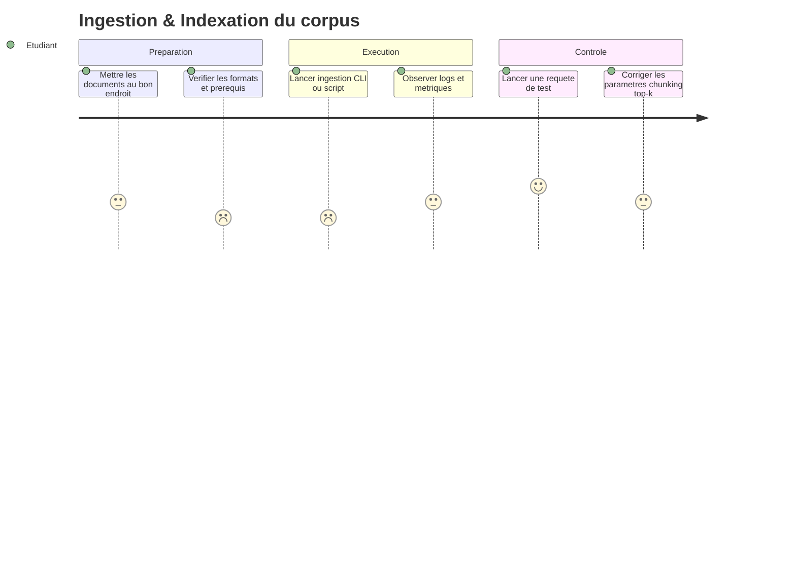
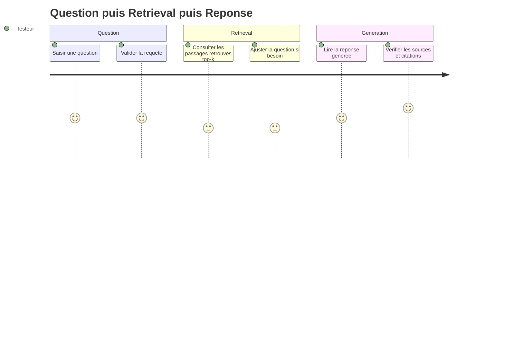

# Personas & Parcours Utilisateurs

## Personas

### Persona 1 : Étudiant·e (participant au TP)

| Attribut               | Valeur |
| ---------------------- | ------ |
| Rôle                   | Étudiant·e / apprenant·e |
| Âge / Contexte         | Études supérieures ; TP en IA/NLP |
| Objectifs              | Comprendre le RAG ; obtenir un prototype qui marche ; réussir la démo/évaluation |
| Frustrations           | Erreurs d’environnement ; flou sur les « bons » paramètres (chunking, top-k) ; difficultés à diagnostiquer un retrieval mauvais |
| Compétences techniques | Intermédiaire (Python/JS) ; notions de LLM ; faible expérience vector DB |
| Quote typique          | « Je veux une pipeline simple, reproductible, et comprendre ce que je fais. » |

### Persona 2 : Enseignant·e / encadrant·e du TP

| Attribut               | Valeur |
| ---------------------- | ------ |
| Rôle                   | Enseignant·e / tuteur·rice |
| Âge / Contexte         | Encadre un TP ; doit évaluer rapidement la compréhension |
| Objectifs              | Avoir un rendu démontrable ; évaluer la démarche ; vérifier la traçabilité (sources) |
| Frustrations           | Projets non reproductibles ; démos qui cassent ; absence de sources/justifications |
| Compétences techniques | Avancé ; connaît les patterns d’architecture et les risques |
| Quote typique          | « Montrez-moi d’où vient la réponse et comment vous avez paramétré le retrieval. » |

### Persona 3 : Utilisateur « final » (testeur du prototype)

| Attribut               | Valeur |
| ---------------------- | ------ |
| Rôle                   | Pair / camarade / correcteur ponctuel |
| Âge / Contexte         | Teste le système via CLI ou interface légère |
| Objectifs              | Poser une question et obtenir une réponse pertinente et rapide |
| Frustrations           | Réponses vagues ; pas de sources ; latence trop élevée |
| Compétences techniques | Variable (faible à moyenne) |
| Quote typique          | « OK, mais quel passage du document te fait dire ça ? » |

## Parcours utilisateurs

### Parcours : Ingestion & Indexation du corpus (Étudiant·e)

#### Contexte

L’étudiant·e dispose d’un dossier de documents (ex: `.txt`, `.md`). Il/elle veut lancer l’ingestion pour préparer l’index vectoriel utilisé ensuite lors des questions.

#### Étapes

| Étape | Action | Pensée | Émotion | Opportunité |
| ----- | ------ | ------ | ------- | ----------- |
| 1 | Choisir/placer le corpus dans un dossier | « Quels formats sont acceptés ? » | 😐 | Documenter formats, exemples et structure attendue |
| 2 | Lancer la commande/script d’ingestion | « J’espère que ça ne va pas planter… » | 😟 | Messages d’erreur actionnables, logs clairs |
| 3 | Découpage en chunks + embeddings | « Quelle taille de chunk choisir ? » | 🤔 | Paramètres configurables + valeurs par défaut recommandées |
| 4 | Indexation dans la base vectorielle | « Est-ce bien stocké ? » | 😐 | Afficher nb docs/chunks indexés, stats, temps |
| 5 | Vérification rapide (sanity check) | « Est-ce que la recherche retrouve quelque chose ? » | 🙂 | Commande de test: query + top-k + extrait |

#### Diagramme de parcours (OBLIGATOIRE)

### Parcours : Question → Retrieval → Réponse (Utilisateur testeur)

#### Contexte

Un utilisateur (testeur) pose une question. Le système récupère les passages pertinents et génère une réponse contextualisée. Le testeur veut comprendre si la réponse est fondée sur les documents.

#### Étapes

| Étape | Action | Pensée | Émotion | Opportunité |
| ----- | ------ | ------ | ------- | ----------- |
| 1 | Saisir une question | « Comment formuler ma question ? » | 😐 | Exemples de questions + auto-complétion (optionnel) |
| 2 | Lancer la recherche | « Est-ce que ça va retrouver les bons passages ? » | 🤔 | Afficher top-k + score + extrait |
| 3 | Générer la réponse via LLM | « Est-ce que la réponse cite le contexte ? » | 🙂 | Prompt contraint + citations/sources |
| 4 | Vérifier les sources | « Je veux voir le texte exact. » | 🙂 | Lien/ID de chunk + surlignage (optionnel) |
| 5 | Itérer (reformulation) | « Si ce n’est pas bon, je retente. » | 😐 | Réglages faciles: top-k, filtre, rerank |

#### Diagramme de parcours (OBLIGATOIRE)

## Matrice Personas / Fonctionnalités

| Fonctionnalité | Étudiant·e | Enseignant·e | Testeur |
| -------------- | --------- | ------------ | ------ |
| Ingestion de documents | Must | Should | Could |
| Chunking paramétrable | Must | Must | Could |
| Indexation en base vectorielle | Must | Must | Could |
| Recherche top-k avec scores | Must | Must | Should |
| Génération LLM contextualisée | Must | Must | Must |
| Affichage des sources (extraits/IDs) | Must | Must | Must |
| Mode évaluation (jeu de tests) | Could | Should | Could |
