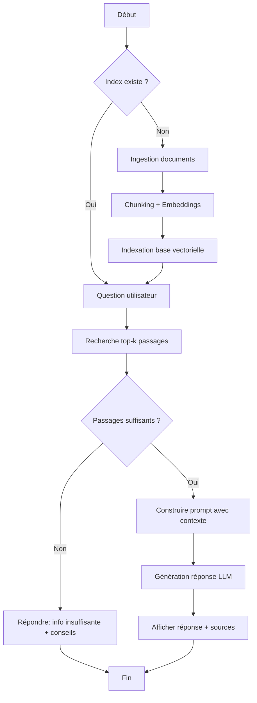

# User Stories & Flux

## Épopées (Epics)

### Epic 1 : Ingestion & Indexation du corpus
**Objectif** : Permettre d’ingérer un corpus de documents et de le transformer en un index vectoriel exploitable.
**Valeur business** : Rendre le prototype RAG opérationnel et reproductible (préparation du corpus).

### Epic 2 : Question → Recherche → Génération
**Objectif** : Permettre à un utilisateur de poser une question et d’obtenir une réponse contextualisée à partir des documents.
**Valeur business** : Démontrer la valeur du RAG (pertinence + réduction d’hallucinations).

### Epic 3 : Observabilité & Traçabilité
**Objectif** : Rendre visibles les passages retrouvés et les paramètres clés (top-k, chunking) pour comprendre/évaluer.
**Valeur business** : Faciliter l’évaluation pédagogique et la qualité des itérations.

## User Stories

### [EPIC-01] Stories (Ingestion & Indexation)

| ID | En tant que | Je veux | Afin de | Priorité | Points |
|----|-------------|---------|---------|----------|--------|
| US-001 | Étudiant·e | fournir un dossier de documents à ingérer | constituer un corpus pour le RAG | Must | 3 |
| US-002 | Étudiant·e | paramétrer le chunking (taille, overlap) | améliorer la qualité de la recherche | Must | 5 |
| US-003 | Étudiant·e | lancer l’indexation vectorielle | pouvoir retrouver des passages pertinents | Must | 5 |
| US-004 | Étudiant·e | obtenir un récapitulatif d’ingestion (nb docs/chunks, durée) | vérifier que l’index est complet | Should | 3 |

### [EPIC-02] Stories (Question & Réponse)

| ID | En tant que | Je veux | Afin de | Priorité | Points |
|----|-------------|---------|---------|----------|--------|
| US-005 | Testeur | poser une question en langage naturel | obtenir une réponse à partir du corpus | Must | 3 |
| US-006 | Testeur | voir les passages retrouvés (top-k) avec score/extrait | comprendre d’où vient la réponse | Must | 5 |
| US-007 | Étudiant·e | choisir le nombre de passages (top-k) | ajuster le compromis précision/bruit | Should | 2 |
| US-008 | Enseignant·e | obtenir une démo reproductible (script/CLI) | évaluer la démarche et le résultat | Must | 3 |

### [EPIC-03] Stories (Observabilité & Qualité)

| ID | En tant que | Je veux | Afin de | Priorité | Points |
|----|-------------|---------|---------|----------|--------|
| US-009 | Étudiant·e | afficher la configuration active (chunking, top-k, modèle d’embedding) | rendre l’exécution reproductible | Should | 2 |
| US-010 | Enseignant·e | vérifier que la réponse est ancrée (sources visibles) | limiter les hallucinations | Must | 3 |
| US-011 | Étudiant·e | lancer un mini « sanity check » de retrieval | détecter rapidement un index inutilisable | Could | 3 |

### Critères d'acceptance

#### US-001 : Ingestion d’un dossier de documents
**Given** un dossier contenant des fichiers `.txt` et/ou `.md`
**When** je lance la commande/script d’ingestion
**Then** le système charge les documents et liste ceux qui ont été pris en compte (au minimum en logs)

#### US-003 : Indexation vectorielle
**Given** un corpus ingéré et découpé en chunks
**When** je lance l’indexation
**Then** les embeddings sont calculés et stockés dans la base vectorielle

#### US-005 : Question utilisateur
**Given** un index vectoriel existant
**When** un utilisateur soumet une question
**Then** le système exécute une recherche et produit une réponse générée

#### US-006 : Affichage des sources
**Given** une recherche top-k effectuée
**When** la réponse est affichée
**Then** les passages retrouvés sont visibles (extrait + score et/ou identifiant de chunk)

#### US-010 : Réponse ancrée
**Given** une question et un contexte retrouvé
**When** le LLM génère la réponse
**Then** la réponse s’appuie sur le contexte (et ne prétend pas savoir si le contexte ne suffit pas)

## Flux utilisateurs (OBLIGATOIRE)

### Flux : Exécution RAG end-to-end (ingestion optionnelle)

## Priorisation (MoSCoW)

| Must Have | Should Have | Could Have | Won't Have |
| --------- | ----------- | ---------- | ---------- |
| Ingestion documents (US-001) | Récap ingestion (US-004) | Sanity check retrieval (US-011) | Interface web complète |
| Indexation vectorielle (US-003) | Param top-k (US-007) | Mode évaluation automatique | Scalabilité / HA |
| Question & réponse (US-005) | Affichage config (US-009) | Reranking/hybrid search | Fine-tuning |
| Sources visibles (US-006, US-010) | Script/CLI robuste (US-008) | UI légère (Streamlit) | Multimodal natif |
