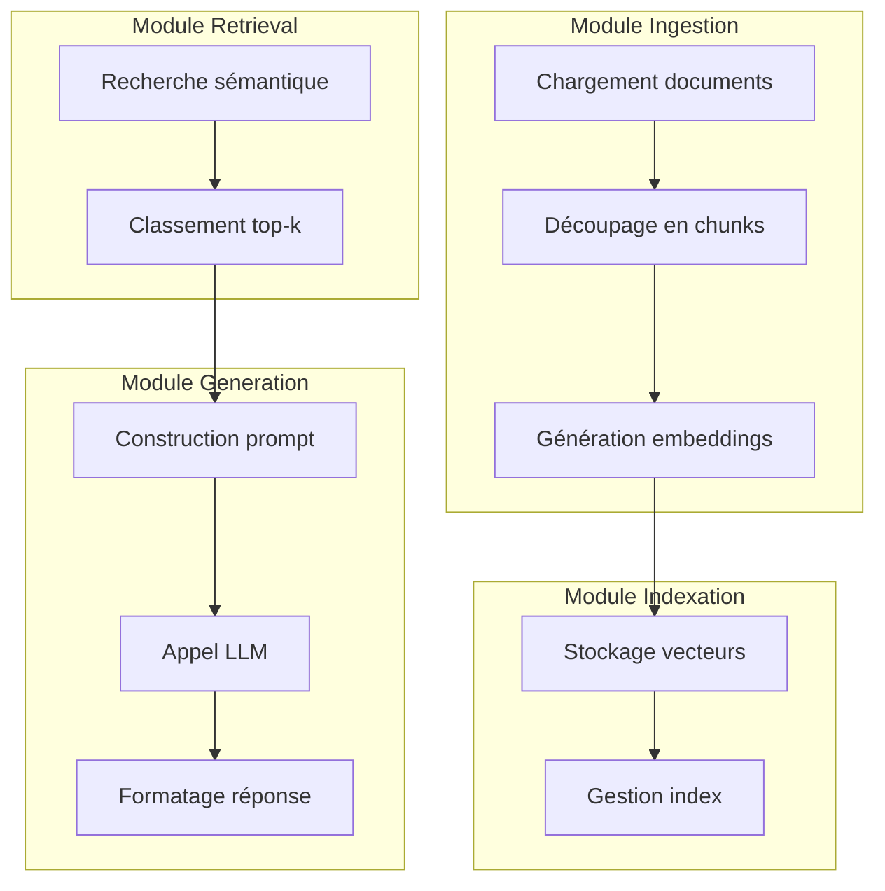
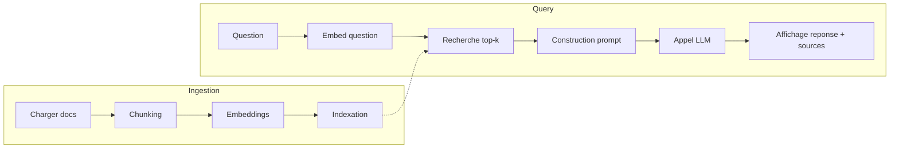

# Spécifications Fonctionnelles

## Vue d'ensemble des modules

## Fonctionnalités détaillées

### F-001 : Chargement de documents

| Attribut      | Valeur |
| ------------- | ------ |
| Module        | Ingestion |
| Priorité      | Must |
| Complexité    | Moyenne |
| Stories liées | US-001 |

#### Description

Le système charge les fichiers textuels depuis un dossier source. Les formats pris en charge sont `.txt` et `.md`. Le chargement produit une liste de documents bruts prêts pour le découpage.

#### Règles métier

- **RG-001** : Seuls les fichiers `.txt` et `.md` sont ingérés ; les autres extensions sont ignorées avec un avertissement en log.
- **RG-002** : Les fichiers vides ou illisibles sont ignorés avec un message d'erreur explicite.
- **RG-003** : Le chemin du dossier source est configurable via paramètre ou fichier de config.

#### Comportement attendu

| Entrée | Traitement | Sortie |
| ------ | ---------- | ------ |
| Chemin dossier | Scan récursif + lecture fichiers valides | Liste de documents {id, contenu, métadonnées} |

#### Cas limites et erreurs

| Cas | Comportement attendu |
| --- | -------------------- |
| Dossier inexistant | Erreur explicite avec chemin attendu |
| Dossier vide | Avertissement + arrêt gracieux |
| Fichier corrompu/non-UTF8 | Skip avec log d'erreur + continuer les autres |
| Fichier volumineux (> 10 Mo) | Avertissement + traitement normal ou option d'exclusion |

---

### F-002 : Découpage en chunks (Chunking)

| Attribut      | Valeur |
| ------------- | ------ |
| Module        | Ingestion |
| Priorité      | Must |
| Complexité    | Moyenne |
| Stories liées | US-002 |

#### Description

Chaque document est découpé en morceaux (chunks) de taille configurable. Un chevauchement (overlap) est appliqué pour préserver le contexte entre chunks consécutifs.

#### Règles métier

- **RG-004** : La taille de chunk (en caractères ou tokens) est configurable ; valeur par défaut = 500 caractères.
- **RG-005** : L'overlap est configurable ; valeur par défaut = 50 caractères (10 % de la taille).
- **RG-006** : Chaque chunk conserve une référence à son document source (id, nom fichier).
- **RG-007** : Un document plus petit que la taille de chunk produit un seul chunk.

#### Comportement attendu

| Entrée | Traitement | Sortie |
| ------ | ---------- | ------ |
| Document brut + params (chunk_size, overlap) | Découpage glissant | Liste de chunks {id, doc_id, texte, position} |

#### Cas limites et erreurs

| Cas | Comportement attendu |
| --- | -------------------- |
| Document vide | Aucun chunk produit, log d'avertissement |
| Chunk size <= overlap | Erreur de configuration, refuser exécution |
| Caractères spéciaux (unicode) | Support UTF-8 correct, pas de troncature invalide |

---

### F-003 : Génération des embeddings

| Attribut      | Valeur |
| ------------- | ------ |
| Module        | Ingestion |
| Priorité      | Must |
| Complexité    | Haute |
| Stories liées | US-003 |

#### Description

Chaque chunk est transformé en vecteur numérique (embedding) via un modèle de représentation sémantique. Le modèle utilisé est configurable.

#### Règles métier

- **RG-008** : Le modèle d'embedding est configurable (ex : `sentence-transformers/all-MiniLM-L6-v2` ou API OpenAI).
- **RG-009** : Le batch size pour le calcul des embeddings est configurable pour optimiser les performances.
- **RG-010** : En cas d'échec d'embedding pour un chunk, log d'erreur + skip du chunk (ne pas bloquer le pipeline).

#### Comportement attendu

| Entrée | Traitement | Sortie |
| ------ | ---------- | ------ |
| Liste de chunks | Appel modèle embedding (local ou API) | Liste {chunk_id, vecteur[]} |

#### Cas limites et erreurs

| Cas | Comportement attendu |
| --- | -------------------- |
| Modèle non disponible | Erreur explicite, arrêt du pipeline |
| Timeout API | Retry configurable (3 tentatives par défaut), puis skip |
| Chunk trop long pour le modèle | Tronquer ou splitter avant embedding avec avertissement |

---

### F-004 : Stockage et indexation vectorielle

| Attribut      | Valeur |
| ------------- | ------ |
| Module        | Indexation |
| Priorité      | Must |
| Complexité    | Moyenne |
| Stories liées | US-003 |

#### Description

Les vecteurs produits sont stockés dans une base vectorielle (locale ou service) avec leurs métadonnées. L'index permet ensuite une recherche par similarité.

#### Règles métier

- **RG-011** : La base vectorielle est configurable (ex : FAISS local, ChromaDB, Pinecone).
- **RG-012** : Chaque vecteur stocke les métadonnées : chunk_id, doc_id, texte du chunk, position.
- **RG-013** : L'index est persisté sur disque pour éviter de recalculer à chaque exécution.
- **RG-014** : Une commande permet de réinitialiser/recréer l'index (mode `--force` ou `--rebuild`).

#### Comportement attendu

| Entrée | Traitement | Sortie |
| ------ | ---------- | ------ |
| Liste {chunk_id, vecteur, métadonnées} | Insertion dans index vectoriel | Index persisté + stats (nb vecteurs, taille) |

#### Cas limites et erreurs

| Cas | Comportement attendu |
| --- | -------------------- |
| Index déjà existant | Append par défaut ou rebuild si option activée |
| Disque plein | Erreur explicite, arrêt propre |
| Vecteur de dimension incorrecte | Erreur au moment de l'insertion, log détaillé |

---

### F-005 : Recherche sémantique (Retrieval)

| Attribut      | Valeur |
| ------------- | ------ |
| Module        | Retrieval |
| Priorité      | Must |
| Complexité    | Moyenne |
| Stories liées | US-005, US-006, US-007 |

#### Description

Une question utilisateur est transformée en embedding puis comparée à l'index pour retrouver les k passages les plus similaires.

#### Règles métier

- **RG-015** : Le paramètre top-k est configurable ; valeur par défaut = 5.
- **RG-016** : Chaque résultat inclut : chunk_id, texte, score de similarité, métadonnées (doc source).
- **RG-017** : La métrique de similarité est configurable (cosine par défaut).
- **RG-018** : Si aucun passage n'atteint un seuil de score minimum configurable, retourner une liste vide.

#### Comportement attendu

| Entrée | Traitement | Sortie |
| ------ | ---------- | ------ |
| Question (texte) + top-k | Embedding question → recherche ANN | Liste de passages {texte, score, metadata}[0..k] |

#### Cas limites et erreurs

| Cas | Comportement attendu |
| --- | -------------------- |
| Index vide ou inexistant | Erreur explicite, inviter à lancer l'ingestion |
| Question vide | Erreur de validation, ne pas lancer la recherche |
| Aucun résultat au-dessus du seuil | Retourner liste vide + message adapté |

---

### F-006 : Construction du prompt contextuel

| Attribut      | Valeur |
| ------------- | ------ |
| Module        | Generation |
| Priorité      | Must |
| Complexité    | Faible |
| Stories liées | US-005, US-010 |

#### Description

Les passages retrouvés sont injectés dans un template de prompt qui sera envoyé au LLM. Le prompt inclut la question et les extraits sources.

#### Règles métier

- **RG-019** : Le template de prompt est configurable (fichier ou variable).
- **RG-020** : Le prompt indique explicitement au LLM de s'appuyer sur le contexte fourni.
- **RG-021** : Si le contexte est insuffisant, le prompt demande au LLM de répondre « information non disponible ».
- **RG-022** : La taille totale du prompt ne doit pas dépasser la limite du modèle (gestion du token limit).

#### Comportement attendu

| Entrée | Traitement | Sortie |
| ------ | ---------- | ------ |
| Question + liste passages | Insertion dans template | Prompt formaté (texte) |

#### Cas limites et erreurs

| Cas | Comportement attendu |
| --- | -------------------- |
| Liste de passages vide | Générer un prompt spécifique « pas de contexte disponible » |
| Dépassement token limit | Tronquer les passages les moins pertinents (par score) |

---

### F-007 : Génération de la réponse (LLM)

| Attribut      | Valeur |
| ------------- | ------ |
| Module        | Generation |
| Priorité      | Must |
| Complexité    | Haute |
| Stories liées | US-005, US-008, US-010 |

#### Description

Le prompt contextuel est envoyé à un modèle de langage (local ou API) qui génère une réponse textuelle.

#### Règles métier

- **RG-023** : Le modèle LLM est configurable (ex : GPT-4o, Claude, Mistral, Ollama local).
- **RG-024** : Les paramètres de génération (temperature, max_tokens) sont configurables.
- **RG-025** : En cas d'échec d'appel, retry configurable puis message d'erreur clair.
- **RG-026** : Un mode « mock » permet de tester sans appel réel (réponse fictive).

#### Comportement attendu

| Entrée | Traitement | Sortie |
| ------ | ---------- | ------ |
| Prompt formaté | Appel API/modèle LLM | Réponse générée (texte) |

#### Cas limites et erreurs

| Cas | Comportement attendu |
| --- | -------------------- |
| API indisponible | Retry puis erreur explicite avec conseil (vérifier clé, réseau) |
| Timeout | Retry puis message d'erreur |
| Réponse vide du LLM | Message par défaut « Le modèle n'a pas pu générer de réponse » |

---

### F-008 : Affichage de la réponse et des sources

| Attribut      | Valeur |
| ------------- | ------ |
| Module        | Generation |
| Priorité      | Must |
| Complexité    | Faible |
| Stories liées | US-006, US-010 |

#### Description

La réponse générée est affichée à l'utilisateur accompagnée des passages sources (extraits, scores, références).

#### Règles métier

- **RG-027** : La réponse affiche clairement le texte généré.
- **RG-028** : Les sources sont listées avec : extrait (tronqué si long), score, identifiant du document source.
- **RG-029** : Le format de sortie est configurable (texte brut, JSON, Markdown).
- **RG-030** : Un mode verbose affiche également la configuration utilisée (top-k, modèle, chunking).

#### Comportement attendu

| Entrée | Traitement | Sortie |
| ------ | ---------- | ------ |
| Réponse LLM + passages | Formatage | Sortie console/fichier structurée |

#### Cas limites et erreurs

| Cas | Comportement attendu |
| --- | -------------------- |
| Aucune source | Afficher « Aucune source trouvée » avec la réponse |
| Réponse très longue | Afficher intégralement (pas de troncature de la réponse) |

---

### F-009 : Récapitulatif d'ingestion

| Attribut      | Valeur |
| ------------- | ------ |
| Module        | Ingestion |
| Priorité      | Should |
| Complexité    | Faible |
| Stories liées | US-004 |

#### Description

À la fin de l'ingestion, un résumé est affiché : nombre de documents traités, nombre de chunks, durée, erreurs éventuelles.

#### Règles métier

- **RG-031** : Le récapitulatif inclut : nb docs, nb chunks, durée totale, nb erreurs/warnings.
- **RG-032** : Les erreurs sont listées avec le fichier concerné.
- **RG-033** : Le récapitulatif peut être exporté en JSON pour traçabilité.

#### Comportement attendu

| Entrée | Traitement | Sortie |
| ------ | ---------- | ------ |
| Stats collectées durant ingestion | Agrégation | Affichage console + option export JSON |

---

### F-010 : Sanity check du retrieval

| Attribut      | Valeur |
| ------------- | ------ |
| Module        | Retrieval |
| Priorité      | Could |
| Complexité    | Faible |
| Stories liées | US-011 |

#### Description

Une commande permet de tester rapidement le retrieval avec une question prédéfinie pour vérifier que l'index fonctionne.

#### Règles métier

- **RG-034** : La commande `--sanity-check` lance une requête de test configurable.
- **RG-035** : Le résultat affiche les k premiers passages et leurs scores.
- **RG-036** : Si aucun résultat ou scores très faibles, afficher un avertissement.

#### Comportement attendu

| Entrée | Traitement | Sortie |
| ------ | ---------- | ------ |
| Question de test (config ou défaut) | Recherche top-k | Liste passages + diagnostic (OK/Warning) |

---

## Matrice des règles métier

| ID | Règle | Fonctionnalités | Validation |
| --- | ----- | --------------- | ---------- |
| RG-001 | Seuls .txt et .md sont ingérés | F-001 | Test unitaire + log |
| RG-002 | Fichiers vides/illisibles ignorés | F-001 | Test unitaire |
| RG-003 | Chemin source configurable | F-001 | Test config |
| RG-004 | Chunk size configurable | F-002 | Test config |
| RG-005 | Overlap configurable | F-002 | Test config |
| RG-006 | Chunk lié à son document | F-002 | Test unitaire |
| RG-007 | Doc < chunk_size = 1 chunk | F-002 | Test unitaire |
| RG-008 | Modèle embedding configurable | F-003 | Test config |
| RG-009 | Batch size configurable | F-003 | Test config |
| RG-010 | Échec embedding = skip + log | F-003 | Test intégration |
| RG-011 | Base vectorielle configurable | F-004 | Test config |
| RG-012 | Métadonnées stockées avec vecteur | F-004 | Test intégration |
| RG-013 | Index persisté | F-004 | Test intégration |
| RG-014 | Option rebuild index | F-004 | Test CLI |
| RG-015 | Top-k configurable | F-005 | Test config |
| RG-016 | Résultat inclut texte, score, meta | F-005 | Test unitaire |
| RG-017 | Métrique similarité configurable | F-005 | Test config |
| RG-018 | Seuil score minimum | F-005 | Test unitaire |
| RG-019 | Template prompt configurable | F-006 | Test config |
| RG-020 | Prompt contraint au contexte | F-006 | Review prompt |
| RG-021 | Réponse « info non dispo » si contexte insuffisant | F-006 | Test intégration |
| RG-022 | Gestion token limit | F-006 | Test intégration |
| RG-023 | Modèle LLM configurable | F-007 | Test config |
| RG-024 | Params génération configurables | F-007 | Test config |
| RG-025 | Retry + erreur explicite | F-007 | Test intégration |
| RG-026 | Mode mock | F-007 | Test unitaire |
| RG-027 | Affichage réponse claire | F-008 | Test manuel |
| RG-028 | Sources avec extrait, score, ref | F-008 | Test intégration |
| RG-029 | Format sortie configurable | F-008 | Test config |
| RG-030 | Mode verbose | F-008 | Test CLI |
| RG-031 | Récap inclut stats complètes | F-009 | Test intégration |
| RG-032 | Erreurs listées par fichier | F-009 | Test intégration |
| RG-033 | Export JSON récap | F-009 | Test CLI |
| RG-034 | Commande sanity-check | F-010 | Test CLI |
| RG-035 | Affichage top-k + scores | F-010 | Test intégration |
| RG-036 | Warning si scores faibles | F-010 | Test intégration |

---

## Diagramme de flux global

---

## Synthèse des paramètres configurables

| Paramètre | Valeur par défaut | Fonctionnalité |
| --------- | ----------------- | -------------- |
| `source_dir` | `./data` | F-001 |
| `chunk_size` | 500 | F-002 |
| `overlap` | 50 | F-002 |
| `embedding_model` | `all-MiniLM-L6-v2` | F-003 |
| `batch_size` | 32 | F-003 |
| `vector_db` | `faiss` | F-004 |
| `index_path` | `./index` | F-004 |
| `top_k` | 5 | F-005 |
| `similarity_metric` | `cosine` | F-005 |
| `score_threshold` | 0.3 | F-005 |
| `prompt_template` | fichier `.prompt` | F-006 |
| `llm_model` | `gpt-4o-mini` | F-007 |
| `temperature` | 0.2 | F-007 |
| `max_tokens` | 512 | F-007 |
| `output_format` | `text` | F-008 |
| `verbose` | `false` | F-008 |
