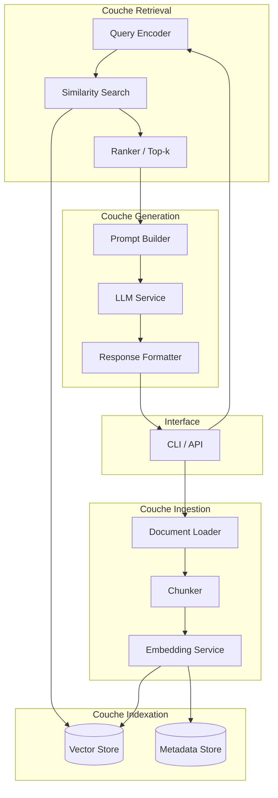
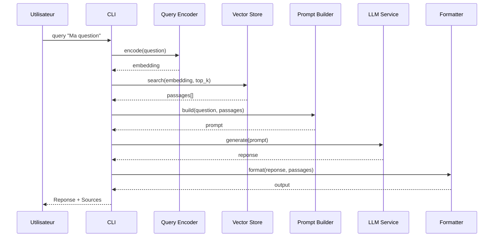

# Décisions d'Architecture (ADR)

## Contexte architectural

Ce document recense les décisions architecturales prises pour le prototype RAG (Retrieval-Augmented Generation). L'objectif est de concevoir un pipeline modulaire, extensible et adapté à un contexte pédagogique (TP), tout en restant proche des pratiques industrielles.

### Vue d'ensemble (OBLIGATOIRE)

---

## Registre des décisions

### ADR-001 : Langage de développement — Python

| Attribut  | Valeur   |
| --------- | -------- |
| Date      | 2026-01-28 |
| Statut    | Accepté  |
| Décideurs | Équipe TP |

#### Contexte

Le brief mentionne un prototype RAG sans imposer de stack. Dans le domaine NLP/LLM, Python est le langage dominant avec un écosystème mature (LangChain, LlamaIndex, sentence-transformers, FAISS, etc.).

#### Options considérées

| Option | Avantages | Inconvénients |
| ------ | --------- | ------------- |
| **Python** | Écosystème NLP/LLM très riche, facilité d'intégration, nombreux exemples, adapté au prototypage | Performance runtime (acceptable pour un TP) |
| TypeScript/Node | Moderne, bon outillage web | Moins de libs ML natives, bindings complexes |
| Go/Rust | Performance, binaires compilés | Écosystème LLM naissant, plus long à développer |

#### Décision

**Python 3.11+** est retenu pour le prototype. Il offre le meilleur compromis productivité / écosystème pour un TP RAG.

#### Conséquences

- **Positives** : Accès direct à sentence-transformers, FAISS, OpenAI SDK, Langchain si souhaité.
- **Négatives** : Packaging et dépendances (virtualenv, pip).
- **Risques** : Compatibilité de versions de libs ML (mitigé via `pyproject.toml` ou `requirements.txt` lock).

---

### ADR-002 : Base de données vectorielle — FAISS (local)

| Attribut  | Valeur   |
| --------- | -------- |
| Date      | 2026-01-28 |
| Statut    | Accepté  |
| Décideurs | Équipe TP |

#### Contexte

Le pipeline requiert une base vectorielle pour stocker les embeddings et exécuter des recherches par similarité (ANN). Le brief n'impose pas de solution.

#### Options considérées

| Option | Avantages | Inconvénients |
| ------ | --------- | ------------- |
| **FAISS (local)** | Open-source, performant, pas de service externe, facile à installer via pip | Pas de persistance native (sérialization manuelle), pas de métadonnées intégrées |
| ChromaDB | Persistance intégrée, métadonnées, API simple | Dépendance supplémentaire, moins mature |
| Pinecone / Weaviate (cloud) | Scalabilité, gestion hébergée | Nécessite compte/API key, latence réseau, hors scope TP |
| Qdrant (local/cloud) | Riche en fonctionnalités | Plus lourd pour un TP basique |

#### Décision

**FAISS** est retenu pour sa simplicité et ses performances. La persistance sera gérée via `faiss.write_index` / `faiss.read_index`. Les métadonnées (chunk text, doc source) seront stockées dans un fichier JSON ou SQLite annexe.

#### Conséquences

- **Positives** : Installation simple (`pip install faiss-cpu`), recherche rapide, contrôle total.
- **Négatives** : Gestion manuelle de la persistance et des métadonnées.
- **Risques** : Si le corpus grossit, envisager ChromaDB ou Qdrant (évolution future).

---

### ADR-003 : Modèle d'embedding — sentence-transformers (local)

| Attribut  | Valeur   |
| --------- | -------- |
| Date      | 2026-01-28 |
| Statut    | Accepté  |
| Décideurs | Équipe TP |

#### Contexte

Les chunks doivent être vectorisés. Le choix du modèle d'embedding impacte la qualité du retrieval et la latence.

#### Options considérées

| Option | Avantages | Inconvénients |
| ------ | --------- | ------------- |
| **sentence-transformers (all-MiniLM-L6-v2)** | Open-source, léger (~80 Mo), fonctionne en local, bonne qualité | Moins performant que modèles plus lourds |
| OpenAI text-embedding-ada-002 / text-embedding-3-small | Très bonne qualité | Coût API, dépendance réseau |
| Cohere Embed | Qualité, multilingue | Coût API |
| BGE / E5 (Hugging Face) | Très bonne qualité, open | Plus lourd, GPU recommandé |

#### Décision

**sentence-transformers** avec le modèle `all-MiniLM-L6-v2` est retenu par défaut. Il offre un bon compromis qualité/légèreté pour un TP. Le modèle est configurable (RG-008) pour permettre d'expérimenter.

#### Conséquences

- **Positives** : Fonctionne sans GPU, installation simple, pas de clé API.
- **Négatives** : Qualité légèrement inférieure aux modèles cloud.
- **Risques** : Si besoin de multilingue ou de meilleure qualité, migrer vers OpenAI ou BGE.

---

### ADR-004 : LLM — API OpenAI (GPT-4o-mini) avec fallback mock

| Attribut  | Valeur   |
| --------- | -------- |
| Date      | 2026-01-28 |
| Statut    | Accepté  |
| Décideurs | Équipe TP |

#### Contexte

La génération de réponse nécessite un LLM. Le brief mentionne la configurabilité (GPT, Claude, Mistral, Ollama).

#### Options considérées

| Option | Avantages | Inconvénients |
| ------ | --------- | ------------- |
| **OpenAI API (GPT-4o-mini)** | Qualité, simplicité d'intégration, coût raisonnable | Requiert clé API, dépendance réseau |
| Ollama (local) | Gratuit, offline | GPU recommandé, qualité variable selon modèle |
| Claude API | Très bonne qualité | Coût, moins courant en TP |
| Mistral API | Bon rapport qualité/prix | Moins d'exemples disponibles |

#### Décision

**OpenAI GPT-4o-mini** est le LLM par défaut (bon rapport qualité/coût). Un **mode mock** (RG-026) est implémenté pour permettre les tests sans appel API. La configuration permet de basculer vers Ollama ou un autre provider.

#### Conséquences

- **Positives** : Qualité de génération élevée, SDK Python bien documenté.
- **Négatives** : Nécessite une clé API, coût (faible pour un TP).
- **Risques** : Si pas de clé, fallback mock ou Ollama.

---

### ADR-005 : Architecture logicielle — Modules découplés (Clean Architecture légère)

| Attribut  | Valeur   |
| --------- | -------- |
| Date      | 2026-01-28 |
| Statut    | Accepté  |
| Décideurs | Équipe TP |

#### Contexte

Le prototype doit être maintenable, testable et extensible (changement de vector store, de modèle, etc.).

#### Options considérées

| Option | Avantages | Inconvénients |
| ------ | --------- | ------------- |
| **Modules découplés (ports/adapters simplifié)** | Testabilité, remplacement facile des composants | Légère complexité initiale |
| Script monolithique | Rapidité de dev initiale | Difficile à maintenir, tester, étendre |
| Framework complet (LangChain) | Abstraction, nombreux connecteurs | Courbe d'apprentissage, dépendance forte |

#### Décision

Architecture en **modules découplés** :

- `ingestion/` : loader, chunker, embedder
- `indexing/` : vector store adapter
- `retrieval/` : query encoder, searcher
- `generation/` : prompt builder, llm adapter, formatter
- `config/` : gestion configuration (YAML/env)
- `cli/` : point d'entrée

Chaque composant expose une interface (protocole Python) permettant de substituer l'implémentation.

#### Conséquences

- **Positives** : Tests unitaires facilités, swap de vector store ou LLM sans toucher au reste.
- **Négatives** : Plus de fichiers que l'approche script unique.
- **Risques** : Sur-ingénierie évitée en gardant les interfaces simples.

---

### ADR-006 : Gestion de la configuration — Fichier YAML + variables d'environnement

| Attribut  | Valeur   |
| --------- | -------- |
| Date      | 2026-01-28 |
| Statut    | Accepté  |
| Décideurs | Équipe TP |

#### Contexte

De nombreux paramètres sont configurables (chunk size, overlap, top-k, modèle, clé API, etc.). Il faut un mécanisme simple et reproductible.

#### Options considérées

| Option | Avantages | Inconvénients |
| ------ | --------- | ------------- |
| **YAML + env vars** | Lisible, standard, secrets séparés | Parsing manuel (mitigé via pydantic-settings) |
| Fichier .env seul | Simple | Moins structuré pour configs complexes |
| Arguments CLI uniquement | Explicite | Verbeux, difficile à reproduire |
| JSON | Standard | Moins lisible que YAML |

#### Décision

Un fichier `config.yaml` centralise la configuration. Les secrets (API keys) sont lus depuis des variables d'environnement ou un fichier `.env` (non versionné). La lib `pydantic-settings` valide et fusionne ces sources.

#### Conséquences

- **Positives** : Reproductibilité (config versionnée), secrets protégés.
- **Négatives** : Dépendance pydantic (acceptable).
- **Risques** : Aucun majeur.

---

### ADR-007 : Interface utilisateur — CLI (+ option API REST future)

| Attribut  | Valeur   |
| --------- | -------- |
| Date      | 2026-01-28 |
| Statut    | Accepté  |
| Décideurs | Équipe TP |

#### Contexte

Le brief demande un prototype fonctionnel ; une interface minimale suffit pour la démo.

#### Options considérées

| Option | Avantages | Inconvénients |
| ------ | --------- | ------------- |
| **CLI (Typer/Click)** | Simple, scriptable, adapté au TP | Moins visuel |
| API REST (FastAPI) | Standard, intégrable | Plus de code, hors scope MVP strict |
| UI Web (Streamlit) | Démo visuelle | Dépendance, hors scope MVP |

#### Décision

**CLI** via `typer` pour le MVP. Commandes : `ingest`, `query`, `status`. Une API REST (FastAPI) pourra être ajoutée en évolution future.

#### Conséquences

- **Positives** : Rapidité de développement, reproductibilité des tests.
- **Négatives** : Moins attractif pour une démo visuelle.
- **Risques** : Aucun (Streamlit peut être ajouté plus tard).

---

### ADR-008 : Persistance des métadonnées — SQLite

| Attribut  | Valeur   |
| --------- | -------- |
| Date      | 2026-01-28 |
| Statut    | Accepté  |
| Décideurs | Équipe TP |

#### Contexte

FAISS ne stocke pas les métadonnées (texte du chunk, doc source). Il faut une solution annexe.

#### Options considérées

| Option | Avantages | Inconvénients |
| ------ | --------- | ------------- |
| **SQLite** | Embarqué, requêtes SQL, robuste | Légère complexité |
| Fichier JSON | Ultra simple | Moins performant, pas de requêtes |
| Pickle | Simple | Sécurité, pas de requêtes |

#### Décision

**SQLite** pour stocker les métadonnées (table `chunks` avec id, doc_id, text, position). Permet des requêtes et reste sans serveur.

#### Conséquences

- **Positives** : Requêtes flexibles, robustesse, standard.
- **Négatives** : Fichier .db à gérer.
- **Risques** : Aucun majeur.

---

## Principes architecturaux

| Principe | Description | Rationale |
| -------- | ----------- | --------- |
| **Modularité** | Chaque composant (loader, embedder, store, llm) est remplaçable | Facilite les expérimentations et les tests |
| **Configuration externalisée** | Aucun paramètre codé en dur | Reproductibilité, adaptation sans recompilation |
| **Fail-fast** | Erreurs détectées au plus tôt (validation config, inputs) | Débogage simplifié |
| **Observabilité** | Logs structurés, affichage des scores et sources | Compréhension du comportement RAG |
| **Simplicité** | Pas de sur-ingénierie, focus sur le pipeline essentiel | Adapté à un TP, maintenabilité |

---

## Contraintes

| Contrainte | Impact | Source |
| ---------- | ------ | ------ |
| Pas d'infrastructure cloud imposée | Tout doit tourner en local | Brief (contexte TP) |
| Corpus de petite taille (< 1 Go) | Pas besoin de sharding, index en mémoire | Brief |
| Accès API LLM optionnel | Prévoir mode mock/offline | Brief |
| Temps de réponse < 5s | Limiter top-k, optimiser embeddings | Brief (objectif) |
| Python 3.11+ | Compatibilité libs ML récentes | ADR-001 |

---

## Diagramme de séquence — Flux Query

---

## Récapitulatif des ADR

| ID | Titre | Décision | Statut |
|----|-------|----------|--------|
| ADR-001 | Langage | Python 3.11+ | Accepté |
| ADR-002 | Vector Store | FAISS (local) | Accepté |
| ADR-003 | Embedding | sentence-transformers (all-MiniLM-L6-v2) | Accepté |
| ADR-004 | LLM | OpenAI GPT-4o-mini + mock | Accepté |
| ADR-005 | Architecture | Modules découplés | Accepté |
| ADR-006 | Configuration | YAML + env vars | Accepté |
| ADR-007 | Interface | CLI (typer) | Accepté |
| ADR-008 | Métadonnées | SQLite | Accepté |
