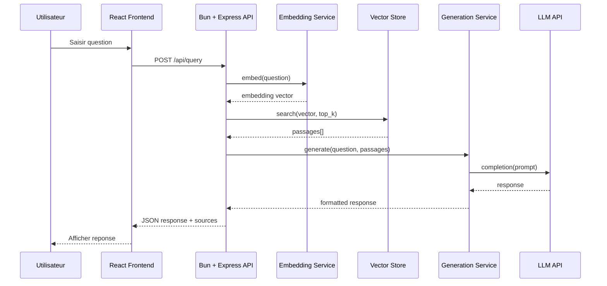

# Décisions d'Architecture (ADR)

## Contexte architectural

Ce document recense les décisions architecturales prises pour le prototype RAG (Retrieval-Augmented Generation). Suite aux clarifications 002 et 004, le projet adopte une stack **TypeScript/React/Bun** avec **Express** (via compatibilité Bun).

### Vue d'ensemble (OBLIGATOIRE)


---

## Registre des décisions

### ADR-001 : Runtime JavaScript — Bun

| Attribut  | Valeur   |
| --------- | -------- |
| Date      | 2026-01-28 |
| Statut    | Accepté (clarification 004) |
| Décideurs | Utilisateur (clarification) |

#### Contexte

La clarification utilisateur `003-bun.md` (normalisée en `004-bun-normalise.md`) a explicitement demandé **Bun** au lieu de Node.js/npm. Cette décision prévaut sur la clarification 002 selon la règle C7 (précédence).

#### Options considérées

| Option | Avantages | Inconvénients |
| ------ | --------- | ------------- |
| **Bun** | 4x plus rapide, TypeScript natif, gestionnaire de paquets intégré, bundler inclus | Moins mature que Node.js |
| Node.js | Écosystème très mature, large communauté | Décision annulée par clarification 004 |

#### Décision

**Bun** est retenu comme runtime JavaScript/TypeScript pour tout le projet. Bun remplace :
- **Node.js** comme runtime
- **npm/yarn/pnpm** comme gestionnaire de paquets
- **esbuild/webpack** pour le bundling TypeScript

#### Conséquences

- **Positives** : Performances accrues, support TypeScript natif (pas de transpilation), installation des dépendances ultra-rapide.
- **Négatives** : Quelques modules npm peuvent avoir des incompatibilités (rares).
- **Risques** : Bun étant plus récent, certains edge cases peuvent survenir. Express fonctionne via la couche de compatibilité.

---

### ADR-002 : Langage de développement — TypeScript

| Attribut  | Valeur   |
| --------- | -------- |
| Date      | 2026-01-28 |
| Statut    | Accepté (clarification 002) |
| Décideurs | Utilisateur (clarification) |

#### Contexte

La clarification utilisateur `001-langage.md` a explicitement demandé TypeScript/React. Bun supporte TypeScript nativement sans configuration.

#### Options considérées

| Option | Avantages | Inconvénients |
| ------ | --------- | ------------- |
| **TypeScript** | Typage statique, écosystème React mature, support natif Bun | Écosystème ML/NLP moins riche que Python |
| Python | Écosystème NLP/LLM très riche | Décision annulée par clarification |

#### Décision

**TypeScript** est retenu pour l'ensemble du projet (frontend et backend). Avec Bun, aucune transpilation n'est nécessaire.

#### Conséquences

- **Positives** : Stack unifiée, partage de types entre front et back, exécution TypeScript native.
- **Négatives** : Moins de libs ML natives, dépendance aux APIs externes pour embeddings.
- **Risques** : Aucun majeur pour ce projet.

---

### ADR-003 : Framework Frontend — React + Vite

| Attribut  | Valeur   |
| --------- | -------- |
| Date      | 2026-01-28 |
| Statut    | Accepté |
| Décideurs | Utilisateur (clarification) |

#### Contexte

Le frontend doit permettre de saisir des questions, afficher les réponses et les sources.

#### Options considérées

| Option | Avantages | Inconvénients |
| ------ | --------- | ------------- |
| **React + Vite** | Demandé par l'utilisateur, Vite compatible Bun, HMR rapide | Config initiale |
| Vue.js | Simplicité, bonne DX | Non demandé |
| Vanilla JS | Pas de dépendances | Moins maintenable |

#### Décision

**React** avec TypeScript, bundlé par **Vite** (compatible Bun). Commande de dev : `bun run dev`.

#### Conséquences

- **Positives** : Composants modulaires, hot reload ultra-rapide avec Bun + Vite.
- **Négatives** : Complexité initiale vs vanilla.
- **Risques** : Aucun majeur pour un prototype.

---

### ADR-004 : Framework Backend — Express.js (via compatibilité Bun)

| Attribut  | Valeur   |
| --------- | -------- |
| Date      | 2026-01-28 |
| Statut    | Accepté (clarification 004) |
| Décideurs | Utilisateur (clarification) |

#### Contexte

Le backend expose une API REST pour l'ingestion et les requêtes RAG. Bun est compatible avec Express.

#### Options considérées

| Option | Avantages | Inconvénients |
| ------ | --------- | ------------- |
| **Express.js** | Standard de facto, middleware riche, compatible Bun | Performances inférieures à Hono/Elysia |
| Hono | Natif Bun, ultra-performant | Moins de middlewares |
| Elysia | TypeScript-first, natif Bun | Moins d'exemples |

#### Décision

**Express.js** exécuté via Bun pour bénéficier de l'écosystème mature d'Express tout en profitant des performances de Bun.

#### Conséquences

- **Positives** : Démarrage rapide, nombreux exemples, middlewares disponibles.
- **Négatives** : Moins performant que Hono/Elysia natifs.
- **Risques** : Aucun pour un prototype — Express fonctionne parfaitement sous Bun.

---

### ADR-005 : Base de données vectorielle — ChromaDB ou Qdrant

| Attribut  | Valeur   |
| --------- | -------- |
| Date      | 2026-01-28 |
| Statut    | Accepté |
| Décideurs | Équipe TP |

#### Contexte

Le pipeline RAG requiert une base vectorielle pour stocker les embeddings et exécuter des recherches par similarité.

#### Options considérées

| Option | Avantages | Inconvénients |
| ------ | --------- | ------------- |
| **ChromaDB** | Open-source, API REST, client JS disponible | Moins mature que FAISS |
| **Qdrant** | Performant, API REST, client TypeScript | Service à lancer séparément |
| FAISS | Performant | Pas de binding natif simple |
| Pinecone | Managed, scalable | Coût, dépendance cloud |

#### Décision

**ChromaDB** en mode serveur local (Docker) avec le client `chromadb` npm. Alternative : **Qdrant** avec `@qdrant/js-client-rest`.

#### Conséquences

- **Positives** : API REST accessible depuis Bun, persistance intégrée.
- **Négatives** : Nécessite Docker pour le serveur ChromaDB/Qdrant.
- **Risques** : Si Docker non disponible, envisager une solution in-memory.

---

### ADR-006 : Modèle d'embedding — API OpenAI ou Transformers.js

| Attribut  | Valeur   |
| --------- | -------- |
| Date      | 2026-01-28 |
| Statut    | Accepté |
| Décideurs | Équipe TP |

#### Contexte

Les chunks doivent être vectorisés. En TypeScript, les options locales sont plus limitées qu'en Python.

#### Options considérées

| Option | Avantages | Inconvénients |
| ------ | --------- | ------------- |
| **OpenAI text-embedding-3-small** | Qualité, simplicité d'intégration | Coût API, dépendance réseau |
| **@xenova/transformers** | Local, gratuit, modèles HuggingFace | Plus lent, plus lourd |
| Cohere Embed | Qualité | Coût API |

#### Décision

**OpenAI text-embedding-3-small** par défaut (SDK `openai` npm). Option **@xenova/transformers** pour mode offline/gratuit avec modèle `all-MiniLM-L6-v2`.

#### Conséquences

- **Positives** : Qualité élevée avec OpenAI, option locale disponible.
- **Négatives** : Coût API pour OpenAI.
- **Risques** : Si pas de clé API, fallback sur transformers.js (plus lent).

---

### ADR-007 : LLM — API OpenAI GPT-4o-mini

| Attribut  | Valeur   |
| --------- | -------- |
| Date      | 2026-01-28 |
| Statut    | Accepté |
| Décideurs | Équipe TP |

#### Contexte

La génération de réponse nécessite un LLM. Le SDK OpenAI fonctionne parfaitement avec Bun.

#### Options considérées

| Option | Avantages | Inconvénients |
| ------ | --------- | ------------- |
| **OpenAI GPT-4o-mini** | Qualité, SDK compatible Bun, coût raisonnable | Requiert clé API |
| Anthropic Claude | Qualité | SDK compatible mais moins d'exemples |
| Ollama (local) | Gratuit, offline | Nécessite installation, GPU recommandé |

#### Décision

**OpenAI GPT-4o-mini** via le SDK `openai`. Un **mode mock** est implémenté pour les tests sans API.

#### Conséquences

- **Positives** : Intégration simple, bonne qualité.
- **Négatives** : Coût (faible pour un TP).
- **Risques** : Si pas de clé, utiliser le mode mock.

---

### ADR-008 : Architecture logicielle — Modules découplés

| Attribut  | Valeur   |
| --------- | -------- |
| Date      | 2026-01-28 |
| Statut    | Accepté |
| Décideurs | Équipe TP |

#### Contexte

Le prototype doit être maintenable, testable et extensible.

#### Décision

Architecture en **modules découplés** :

```
project/
├── backend/
│   └── src/
│       ├── api/           # Routes Express
│       ├── services/
│       │   ├── ingestion/ # Loader, Chunker
│       │   ├── embedding/ # Embedding service
│       │   ├── search/    # Vector search
│       │   └── generation/# Prompt builder, LLM caller
│       ├── repositories/  # Vector store, metadata store
│       ├── config/        # Configuration
│       └── types/         # TypeScript interfaces
├── frontend/
│   └── src/
│       ├── components/    # React components
│       ├── hooks/         # Custom hooks
│       ├── services/      # API calls
│       └── types/         # TypeScript types
└── shared/
    └── types/             # Types partagés front/back
```

#### Conséquences

- **Positives** : Tests unitaires facilités, swap de vector store ou LLM sans toucher au reste.
- **Négatives** : Plus de fichiers que l'approche script unique.

---

### ADR-009 : Gestion de la configuration — .env natif Bun + config.ts

| Attribut  | Valeur   |
| --------- | -------- |
| Date      | 2026-01-28 |
| Statut    | Accepté |
| Décideurs | Équipe TP |

#### Contexte

De nombreux paramètres sont configurables (chunk size, top-k, clé API, etc.).

#### Décision

- Variables d'environnement via fichier `.env` (Bun supporte nativement `.env` via `Bun.env`)
- Fichier `config.ts` centralisant les valeurs par défaut et la validation (avec `zod`)

#### Conséquences

- **Positives** : Secrets protégés, configuration typée, pas besoin de `dotenv` (natif Bun).
- **Négatives** : Nécessite de documenter les variables.

---

### ADR-010 : Persistance des métadonnées — SQLite avec bun:sqlite

| Attribut  | Valeur   |
| --------- | -------- |
| Date      | 2026-01-28 |
| Statut    | Accepté |
| Décideurs | Équipe TP |

#### Contexte

Les métadonnées (texte du chunk, document source) doivent être stockées.

#### Décision

**SQLite** via `bun:sqlite` (API native Bun, synchrone, ultra-performante). Table `chunks` avec id, doc_id, text, position.

#### Conséquences

- **Positives** : Requêtes SQL flexibles, pas de serveur, API native Bun (pas de dépendance npm).
- **Négatives** : Fichier .db à gérer.

---

## Principes architecturaux

| Principe | Description | Rationale |
| -------- | ----------- | --------- |
| **Modularité** | Chaque composant (loader, embedder, store, llm) est remplaçable | Facilite les expérimentations et les tests |
| **Configuration externalisée** | Aucun paramètre codé en dur | Reproductibilité |
| **Typage strict** | TypeScript strict mode activé | Fiabilité, autocomplétion |
| **Fail-fast** | Erreurs détectées au plus tôt (validation zod) | Débogage simplifié |
| **Observabilité** | Logs structurés, affichage des scores et sources | Compréhension du comportement RAG |
| **Bun-first** | Privilégier les APIs natives Bun quand disponibles | Performance optimale |

---

## Contraintes

| Contrainte | Impact | Source |
| ---------- | ------ | ------ |
| Bun comme runtime | Remplace Node.js et npm | Clarification 004 |
| TypeScript/React imposé | Stack unifiée JS | Clarification 002 |
| Express via compatibilité | Framework backend | Clarification 004 |
| Corpus de petite taille | Pas besoin de sharding | Brief |
| Accès API LLM optionnel | Prévoir mode mock | Brief |
| Temps de réponse < 5s | Limiter top-k, optimiser | Brief |
| Bun 1.x+ | Support complet TypeScript natif | Best practice |

---

## Diagramme de séquence — Flux Query



---

## Récapitulatif des ADR

| ID | Titre | Décision | Statut |
|----|-------|----------|--------|
| ADR-001 | Runtime | **Bun** | Accepté (clarification 004) |
| ADR-002 | Langage | TypeScript | Accepté (clarification 002) |
| ADR-003 | Frontend | React + Vite | Accepté |
| ADR-004 | Backend | Express.js (via Bun) | Accepté (clarification 004) |
| ADR-005 | Vector Store | ChromaDB / Qdrant | Accepté |
| ADR-006 | Embedding | OpenAI / Transformers.js | Accepté |
| ADR-007 | LLM | OpenAI GPT-4o-mini | Accepté |
| ADR-008 | Architecture | Modules découplés | Accepté |
| ADR-009 | Configuration | .env natif Bun + config.ts | Accepté |
| ADR-010 | Métadonnées | SQLite (bun:sqlite) | Accepté |
