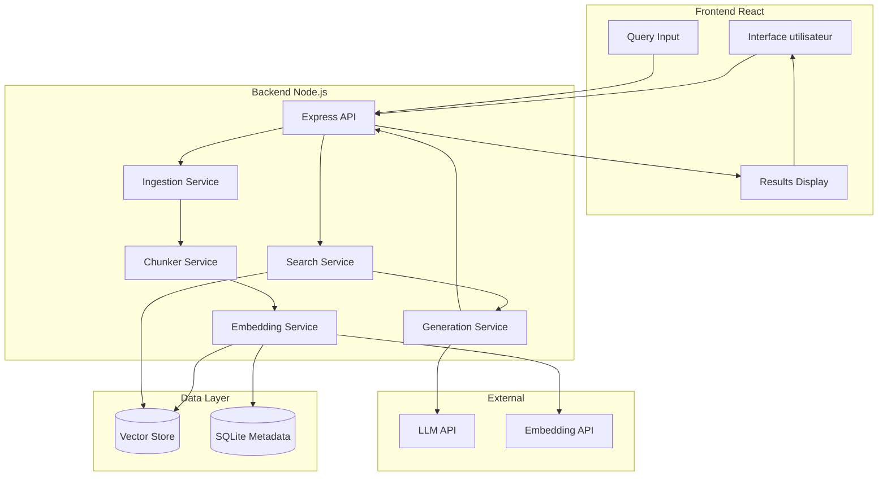
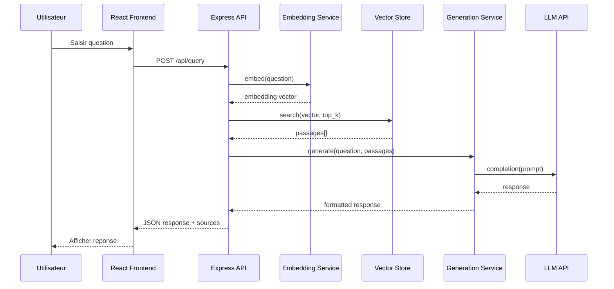

# Décisions d'Architecture (ADR)

## Contexte architectural

Ce document recense les décisions architecturales prises pour le prototype RAG (Retrieval-Augmented Generation). Suite à la clarification 002, le projet adopte une stack **TypeScript/React/Node.js** au lieu de Python.

### Vue d'ensemble (OBLIGATOIRE)



---

## Registre des décisions

### ADR-001 : Langage de développement — TypeScript

| Attribut  | Valeur   |
| --------- | -------- |
| Date      | 2026-01-28 |
| Statut    | Accepté (modifié via clarification 002) |
| Décideurs | Utilisateur (clarification) |

#### Contexte

La clarification utilisateur `001-langage.md` a explicitement demandé TypeScript/React. Cette décision prévaut sur le choix initial Python selon la règle C7 (précédence).

#### Options considérées

| Option | Avantages | Inconvénients |
| ------ | --------- | ------------- |
| **TypeScript** | Typage statique, écosystème React mature, full-stack JS | Écosystème ML/NLP moins riche que Python |
| Python | Écosystème NLP/LLM très riche | Décision annulée par clarification |

#### Décision

**TypeScript** est retenu pour l'ensemble du projet (frontend et backend).

#### Conséquences

- **Positives** : Stack unifiée, partage de types entre front et back, écosystème npm riche.
- **Négatives** : Moins de libs ML natives, dépendance aux APIs externes pour embeddings.
- **Risques** : Certaines fonctionnalités RAG avancées moins accessibles qu'en Python.

---

### ADR-002 : Framework Frontend — React

| Attribut  | Valeur   |
| --------- | -------- |
| Date      | 2026-01-28 |
| Statut    | Accepté |
| Décideurs | Utilisateur (clarification) |

#### Contexte

Le frontend doit permettre de saisir des questions, afficher les réponses et les sources.

#### Options considérées

| Option | Avantages | Inconvénients |
| ------ | --------- | ------------- |
| **React** | Demandé par l'utilisateur, large écosystème, composants réutilisables | Nécessite configuration build |
| Vue.js | Simplicité, bonne DX | Non demandé |
| Vanilla JS | Pas de dépendances | Moins maintenable |

#### Décision

**React** avec TypeScript. Utilisation de Vite pour le bundling.

#### Conséquences

- **Positives** : Composants modulaires, hot reload, large communauté.
- **Négatives** : Complexité initiale vs vanilla.
- **Risques** : Aucun majeur pour un prototype.

---

### ADR-003 : Framework Backend — Express.js

| Attribut  | Valeur   |
| --------- | -------- |
| Date      | 2026-01-28 |
| Statut    | Accepté |
| Décideurs | Utilisateur (clarification) |

#### Contexte

Le backend expose une API REST pour l'ingestion et les requêtes RAG.

#### Options considérées

| Option | Avantages | Inconvénients |
| ------ | --------- | ------------- |
| **Express.js** | Standard de facto, simple, middleware riche | Performances moyennes |
| Fastify | Performant, schéma JSON intégré | Moins de middlewares tiers |
| Next.js API Routes | Full-stack intégré | Moins flexible pour API pure |

#### Décision

**Express.js** pour sa simplicité et son écosystème. Fastify est une alternative acceptable si la performance devient critique.

#### Conséquences

- **Positives** : Démarrage rapide, nombreux exemples, middlewares disponibles.
- **Négatives** : Moins performant que Fastify pour du high-throughput.
- **Risques** : Aucun pour un prototype.

---

### ADR-004 : Base de données vectorielle — ChromaDB ou Qdrant

| Attribut  | Valeur   |
| --------- | -------- |
| Date      | 2026-01-28 |
| Statut    | Accepté |
| Décideurs | Équipe TP |

#### Contexte

Le pipeline RAG requiert une base vectorielle pour stocker les embeddings et exécuter des recherches par similarité.

#### Options considérées

| Option | Avantages | Inconvénients |
| ------ | --------- | ------------- |
| **ChromaDB** | Open-source, API REST, client JS disponible | Moins mature que FAISS |
| **Qdrant** | Performant, API REST, client TypeScript | Service à lancer séparément |
| FAISS | Performant | Pas de binding Node.js natif simple |
| Pinecone | Managed, scalable | Coût, dépendance cloud |

#### Décision

**ChromaDB** en mode serveur local (Docker) avec le client `chromadb` npm. Alternative : **Qdrant** avec `@qdrant/js-client-rest`.

#### Conséquences

- **Positives** : API REST accessible depuis Node.js, persistance intégrée.
- **Négatives** : Nécessite Docker pour le serveur ChromaDB/Qdrant.
- **Risques** : Si Docker non disponible, envisager une solution in-memory.

---

### ADR-005 : Modèle d'embedding — API OpenAI ou Transformers.js

| Attribut  | Valeur   |
| --------- | -------- |
| Date      | 2026-01-28 |
| Statut    | Accepté |
| Décideurs | Équipe TP |

#### Contexte

Les chunks doivent être vectorisés. En TypeScript, les options locales sont plus limitées qu'en Python.

#### Options considérées

| Option | Avantages | Inconvénients |
| ------ | --------- | ------------- |
| **OpenAI text-embedding-3-small** | Qualité, simplicité d'intégration | Coût API, dépendance réseau |
| **@xenova/transformers** | Local, gratuit, modèles HuggingFace | Plus lent, plus lourd |
| Cohere Embed | Qualité | Coût API |

#### Décision

**OpenAI text-embedding-3-small** par défaut (SDK `openai` npm). Option **@xenova/transformers** pour mode offline/gratuit avec modèle `all-MiniLM-L6-v2`.

#### Conséquences

- **Positives** : Qualité élevée avec OpenAI, option locale disponible.
- **Négatives** : Coût API pour OpenAI.
- **Risques** : Si pas de clé API, fallback sur transformers.js (plus lent).

---

### ADR-006 : LLM — API OpenAI GPT-4o-mini

| Attribut  | Valeur   |
| --------- | -------- |
| Date      | 2026-01-28 |
| Statut    | Accepté |
| Décideurs | Équipe TP |

#### Contexte

La génération de réponse nécessite un LLM. Le SDK OpenAI pour Node.js est mature.

#### Options considérées

| Option | Avantages | Inconvénients |
| ------ | --------- | ------------- |
| **OpenAI GPT-4o-mini** | Qualité, SDK Node.js, coût raisonnable | Requiert clé API |
| Anthropic Claude | Qualité | Moins d'exemples Node.js |
| Ollama (local) | Gratuit, offline | Nécessite installation, GPU recommandé |

#### Décision

**OpenAI GPT-4o-mini** via le SDK `openai`. Un **mode mock** est implémenté pour les tests sans API.

#### Conséquences

- **Positives** : Intégration simple, bonne qualité.
- **Négatives** : Coût (faible pour un TP).
- **Risques** : Si pas de clé, utiliser le mode mock.

---

### ADR-007 : Architecture logicielle — Modules découplés

| Attribut  | Valeur   |
| --------- | -------- |
| Date      | 2026-01-28 |
| Statut    | Accepté |
| Décideurs | Équipe TP |

#### Contexte

Le prototype doit être maintenable, testable et extensible.

#### Décision

Architecture en **modules découplés** :

```
src/
├── api/           # Routes Express
├── services/
│   ├── ingestion/ # Loader, Chunker
│   ├── embedding/ # Embedding service
│   ├── search/    # Vector search
│   └── generation/# Prompt builder, LLM caller
├── repositories/  # Vector store, metadata store
├── config/        # Configuration
└── types/         # TypeScript interfaces
```

Chaque service expose une interface permettant de substituer l'implémentation.

#### Conséquences

- **Positives** : Tests unitaires facilités, swap de vector store ou LLM sans toucher au reste.
- **Négatives** : Plus de fichiers que l'approche script unique.

---

### ADR-008 : Gestion de la configuration — dotenv + fichier config

| Attribut  | Valeur   |
| --------- | -------- |
| Date      | 2026-01-28 |
| Statut    | Accepté |
| Décideurs | Équipe TP |

#### Contexte

De nombreux paramètres sont configurables (chunk size, top-k, clé API, etc.).

#### Décision

- Variables d'environnement via `dotenv` (fichier `.env` non versionné)
- Fichier `config.ts` centralisant les valeurs par défaut et la validation (avec `zod`)

#### Conséquences

- **Positives** : Secrets protégés, configuration typée.
- **Négatives** : Nécessite de documenter les variables.

---

### ADR-009 : Persistance des métadonnées — SQLite avec better-sqlite3

| Attribut  | Valeur   |
| --------- | -------- |
| Date      | 2026-01-28 |
| Statut    | Accepté |
| Décideurs | Équipe TP |

#### Contexte

Les métadonnées (texte du chunk, document source) doivent être stockées.

#### Décision

**SQLite** via `better-sqlite3` (synchrone, performant). Table `chunks` avec id, doc_id, text, position.

#### Conséquences

- **Positives** : Requêtes SQL flexibles, pas de serveur.
- **Négatives** : Fichier .db à gérer.

---

## Principes architecturaux

| Principe | Description | Rationale |
| -------- | ----------- | --------- |
| **Modularité** | Chaque composant (loader, embedder, store, llm) est remplaçable | Facilite les expérimentations et les tests |
| **Configuration externalisée** | Aucun paramètre codé en dur | Reproductibilité |
| **Typage strict** | TypeScript strict mode activé | Fiabilité, autocomplétion |
| **Fail-fast** | Erreurs détectées au plus tôt (validation zod) | Débogage simplifié |
| **Observabilité** | Logs structurés (pino), affichage des scores et sources | Compréhension du comportement RAG |

---

## Contraintes

| Contrainte | Impact | Source |
| ---------- | ------ | ------ |
| TypeScript/React imposé | Stack unifiée JS | Clarification utilisateur |
| Corpus de petite taille | Pas besoin de sharding | Brief |
| Accès API LLM optionnel | Prévoir mode mock | Brief |
| Temps de réponse < 5s | Limiter top-k, optimiser | Brief |
| Node.js 20+ | Support ESM, fetch natif | Best practice |

---

## Diagramme de séquence — Flux Query



---

## Récapitulatif des ADR

| ID | Titre | Décision | Statut |
|----|-------|----------|--------|
| ADR-001 | Langage | TypeScript | Accepté |
| ADR-002 | Frontend | React | Accepté |
| ADR-003 | Backend | Express.js | Accepté |
| ADR-004 | Vector Store | ChromaDB / Qdrant | Accepté |
| ADR-005 | Embedding | OpenAI / Transformers.js | Accepté |
| ADR-006 | LLM | OpenAI GPT-4o-mini | Accepté |
| ADR-007 | Architecture | Modules découplés | Accepté |
| ADR-008 | Configuration | dotenv + config.ts | Accepté |
| ADR-009 | Métadonnées | SQLite (better-sqlite3) | Accepté |
