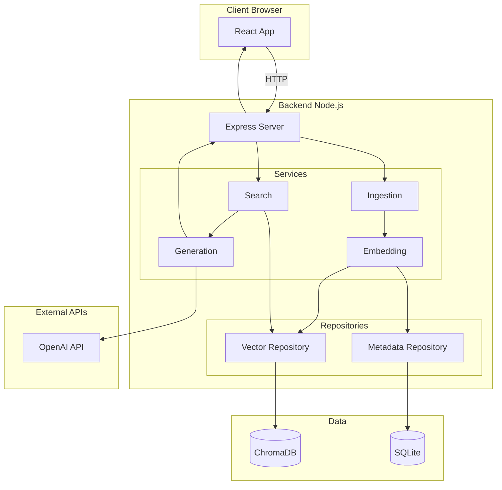
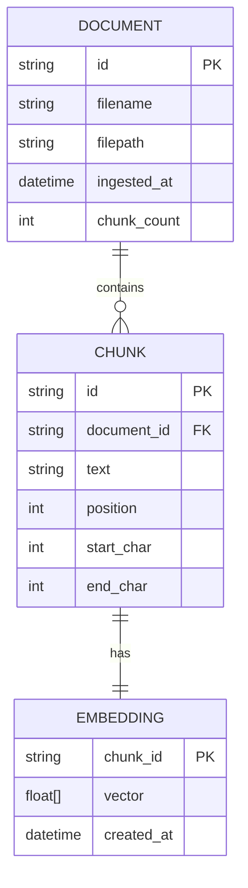

# Spécifications Techniques

## Stack technique

| Couche | Technologie | Version | Justification |
|--------|-------------|---------|---------------|
| Frontend | React + TypeScript | React 18.x | Demandé par clarification, composants réactifs |
| Frontend Build | Vite | 5.x | Build rapide, HMR, ESM natif |
| Backend | Node.js + Express | Node 20.x, Express 4.x | Simplicité, écosystème mature |
| Base vectorielle | ChromaDB ou Qdrant | Latest | API REST, client JS disponible |
| Métadonnées | SQLite | 3.x | Léger, embarqué, requêtes SQL |
| Embeddings | OpenAI API / Transformers.js | - | Qualité + option locale |
| LLM | OpenAI GPT-4o-mini | - | Qualité, SDK mature |
| Validation | Zod | 3.x | Validation runtime typée |
| Logs | Pino | 8.x | Logs structurés JSON |

## Architecture technique (OBLIGATOIRE)



## Structure du projet

```
rag-tp/
├── frontend/
│   ├── src/
│   │   ├── components/
│   │   │   ├── QueryInput.tsx
│   │   │   ├── ResultDisplay.tsx
│   │   │   └── SourceList.tsx
│   │   ├── hooks/
│   │   │   └── useQuery.ts
│   │   ├── services/
│   │   │   └── api.ts
│   │   ├── types/
│   │   │   └── index.ts
│   │   ├── App.tsx
│   │   └── main.tsx
│   ├── package.json
│   ├── tsconfig.json
│   └── vite.config.ts
├── backend/
│   ├── src/
│   │   ├── api/
│   │   │   ├── routes/
│   │   │   │   ├── ingest.ts
│   │   │   │   └── query.ts
│   │   │   └── index.ts
│   │   ├── services/
│   │   │   ├── ingestion/
│   │   │   │   ├── loader.ts
│   │   │   │   └── chunker.ts
│   │   │   ├── embedding/
│   │   │   │   ├── embedder.ts
│   │   │   │   └── openai-embedder.ts
│   │   │   ├── search/
│   │   │   │   └── searcher.ts
│   │   │   └── generation/
│   │   │       ├── prompt-builder.ts
│   │   │       └── llm-caller.ts
│   │   ├── repositories/
│   │   │   ├── vector-store.ts
│   │   │   └── metadata-store.ts
│   │   ├── config/
│   │   │   └── index.ts
│   │   ├── types/
│   │   │   └── index.ts
│   │   └── index.ts
│   ├── package.json
│   └── tsconfig.json
├── data/
│   └── documents/
├── .env.example
├── docker-compose.yml
└── README.md
```

## Modèle de données

### Entités principales



### Dictionnaire de données

| Entité | Champ | Type | Contraintes | Description |
| ------ | ----- | ---- | ----------- | ----------- |
| Document | id | string (UUID) | PK, NOT NULL | Identifiant unique du document |
| Document | filename | string | NOT NULL | Nom du fichier original |
| Document | filepath | string | NOT NULL | Chemin relatif du fichier |
| Document | ingested_at | datetime | NOT NULL | Date d'ingestion |
| Document | chunk_count | int | NOT NULL | Nombre de chunks générés |
| Chunk | id | string (UUID) | PK, NOT NULL | Identifiant unique du chunk |
| Chunk | document_id | string | FK, NOT NULL | Référence au document parent |
| Chunk | text | string | NOT NULL | Contenu textuel du chunk |
| Chunk | position | int | NOT NULL | Position du chunk dans le document |
| Chunk | start_char | int | NOT NULL | Position de début dans le document |
| Chunk | end_char | int | NOT NULL | Position de fin dans le document |

## Spécifications API

### Endpoints

| Méthode | Endpoint | Description | Auth |
| ------- | -------- | ----------- | ---- |
| POST | /api/ingest | Ingère un dossier de documents | - |
| GET | /api/status | Statut de l'index (nb docs, chunks) | - |
| POST | /api/query | Exécute une requête RAG | - |
| GET | /api/health | Health check | - |

### Contrats d'API

#### `POST /api/ingest`

**Description** : Ingère les documents d'un dossier, génère les chunks et embeddings.

**Request** :

```json
{
  "sourcePath": "./data/documents",
  "options": {
    "chunkSize": 500,
    "chunkOverlap": 50,
    "rebuild": false
  }
}
```

**Response 200** :

```json
{
  "success": true,
  "stats": {
    "documentsProcessed": 5,
    "chunksCreated": 42,
    "duration": 3500,
    "errors": []
  }
}
```

**Response 400** :

```json
{
  "success": false,
  "error": "Source path does not exist"
}
```

---

#### `POST /api/query`

**Description** : Exécute une recherche sémantique et génère une réponse.

**Request** :

```json
{
  "question": "Comment fonctionne le RAG ?",
  "options": {
    "topK": 5,
    "temperature": 0.2
  }
}
```

**Response 200** :

```json
{
  "success": true,
  "answer": "Le RAG (Retrieval-Augmented Generation) fonctionne en...",
  "sources": [
    {
      "chunkId": "abc-123",
      "documentId": "doc-456",
      "filename": "rag-intro.md",
      "text": "Le RAG combine la recherche de documents...",
      "score": 0.89
    }
  ],
  "metadata": {
    "model": "gpt-4o-mini",
    "topK": 5,
    "duration": 1200
  }
}
```

**Response 400** :

```json
{
  "success": false,
  "error": "Index is empty. Please run ingestion first."
}
```

---

#### `GET /api/status`

**Description** : Retourne le statut de l'index.

**Response 200** :

```json
{
  "indexed": true,
  "documentsCount": 5,
  "chunksCount": 42,
  "lastIngestion": "2026-01-28T10:00:00Z",
  "config": {
    "chunkSize": 500,
    "chunkOverlap": 50,
    "embeddingModel": "text-embedding-3-small"
  }
}
```

---

## Interfaces TypeScript

### Types partagés

```typescript
// types/index.ts

export interface Document {
  id: string;
  filename: string;
  filepath: string;
  ingestedAt: Date;
  chunkCount: number;
}

export interface Chunk {
  id: string;
  documentId: string;
  text: string;
  position: number;
  startChar: number;
  endChar: number;
}

export interface SearchResult {
  chunkId: string;
  documentId: string;
  filename: string;
  text: string;
  score: number;
}

export interface QueryResponse {
  success: boolean;
  answer: string;
  sources: SearchResult[];
  metadata: {
    model: string;
    topK: number;
    duration: number;
  };
}

export interface IngestOptions {
  chunkSize: number;
  chunkOverlap: number;
  rebuild: boolean;
}

export interface QueryOptions {
  topK: number;
  temperature: number;
}
```

### Interfaces de services

```typescript
// services/embedding/embedder.ts
export interface Embedder {
  embed(text: string): Promise<number[]>;
  embedBatch(texts: string[]): Promise<number[][]>;
}

// services/search/searcher.ts
export interface Searcher {
  search(query: string, topK: number): Promise<SearchResult[]>;
}

// services/generation/llm-caller.ts
export interface LLMCaller {
  generate(prompt: string, options?: GenerateOptions): Promise<string>;
}
```

## Configuration

### Variables d'environnement

| Variable | Description | Valeur par défaut | Requis |
| -------- | ----------- | ----------------- | ------ |
| `OPENAI_API_KEY` | Clé API OpenAI | - | Oui* |
| `EMBEDDING_MODEL` | Modèle d'embedding | `text-embedding-3-small` | Non |
| `LLM_MODEL` | Modèle LLM | `gpt-4o-mini` | Non |
| `CHROMA_URL` | URL du serveur ChromaDB | `http://localhost:8000` | Non |
| `CHUNK_SIZE` | Taille des chunks (caractères) | `500` | Non |
| `CHUNK_OVERLAP` | Chevauchement des chunks | `50` | Non |
| `TOP_K` | Nombre de résultats par défaut | `5` | Non |
| `PORT` | Port du serveur Express | `3001` | Non |
| `MOCK_MODE` | Mode mock (sans API) | `false` | Non |

*Requis sauf si `MOCK_MODE=true`

### Fichier .env.example

```env
# OpenAI
OPENAI_API_KEY=sk-...

# Embedding
EMBEDDING_MODEL=text-embedding-3-small

# LLM
LLM_MODEL=gpt-4o-mini

# Vector Store
CHROMA_URL=http://localhost:8000

# Chunking
CHUNK_SIZE=500
CHUNK_OVERLAP=50

# Search
TOP_K=5

# Server
PORT=3001

# Development
MOCK_MODE=false
```

## Intégrations externes

| Système | Type | Protocole | Authentification |
| ------- | ---- | --------- | ---------------- |
| OpenAI API | Embeddings + LLM | HTTPS REST | API Key (Bearer) |
| ChromaDB | Vector Store | HTTP REST | None (local) |

## Exigences non-fonctionnelles

| Catégorie | Exigence | Cible |
| --------- | -------- | ----- |
| Performance | Temps de réponse query | < 5s (p95) |
| Performance | Temps d'ingestion | < 1s/document (petit) |
| Disponibilité | Uptime dev | Best effort |
| Sécurité | API Keys | Variables d'environnement, non versionnées |
| Sécurité | CORS | Configuré pour frontend uniquement |
| Maintenabilité | Couverture tests | > 70% |
| Observabilité | Logs | Structurés JSON (pino) |

## Dépendances npm

### Backend (backend/package.json)

```json
{
  "dependencies": {
    "express": "^4.18.0",
    "cors": "^2.8.5",
    "dotenv": "^16.3.0",
    "zod": "^3.22.0",
    "pino": "^8.16.0",
    "pino-pretty": "^10.2.0",
    "openai": "^4.20.0",
    "chromadb": "^1.7.0",
    "better-sqlite3": "^9.2.0",
    "uuid": "^9.0.0"
  },
  "devDependencies": {
    "@types/express": "^4.17.0",
    "@types/cors": "^2.8.0",
    "@types/better-sqlite3": "^7.6.0",
    "@types/uuid": "^9.0.0",
    "typescript": "^5.3.0",
    "tsx": "^4.6.0",
    "vitest": "^1.0.0"
  }
}
```

### Frontend (frontend/package.json)

```json
{
  "dependencies": {
    "react": "^18.2.0",
    "react-dom": "^18.2.0"
  },
  "devDependencies": {
    "@types/react": "^18.2.0",
    "@types/react-dom": "^18.2.0",
    "@vitejs/plugin-react": "^4.2.0",
    "typescript": "^5.3.0",
    "vite": "^5.0.0"
  }
}
```

## Docker Compose (développement)

```yaml
# docker-compose.yml
version: '3.8'

services:
  chromadb:
    image: chromadb/chroma:latest
    ports:
      - "8000:8000"
    volumes:
      - chroma_data:/chroma/chroma

volumes:
  chroma_data:
```

## Scripts de développement

| Script | Commande | Description |
| ------ | -------- | ----------- |
| Backend dev | `npm run dev` | Lance le serveur avec tsx watch |
| Backend build | `npm run build` | Compile TypeScript |
| Frontend dev | `npm run dev` | Lance Vite dev server |
| Frontend build | `npm run build` | Build production |
| Tests | `npm test` | Lance vitest |
| Lint | `npm run lint` | ESLint |
| Docker up | `docker-compose up -d` | Lance ChromaDB |
