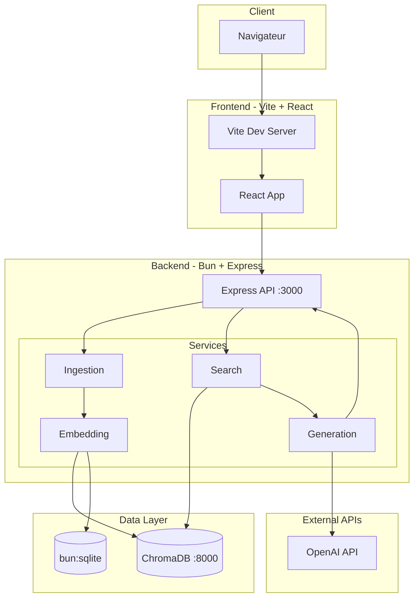
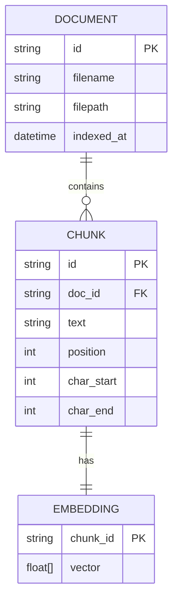

# Spécifications Techniques

## Stack technique

| Couche | Technologie | Version | Justification |
|--------|-------------|---------|---------------|
| **Runtime** | Bun | 1.x+ | Clarification 004 : remplace Node.js/npm |
| **Langage** | TypeScript | 5.x | Clarification 002 : typage statique, support natif Bun |
| **Frontend** | React + Vite | React 18.x, Vite 5.x | Clarification 002 : SPA moderne, HMR rapide |
| **Backend** | Express.js | 4.x | Clarification 004 : via compatibilité Bun |
| **Base vectorielle** | ChromaDB / Qdrant | Latest | Recherche par similarité |
| **Métadonnées** | SQLite | Via bun:sqlite | API native Bun, performant |
| **Embedding** | OpenAI / Transformers.js | - | Qualité + option offline |
| **LLM** | OpenAI GPT-4o-mini | - | Génération de réponses |
| **Validation** | Zod | 3.x | Schémas TypeScript-first |
| **Tests** | Bun test | Intégré | Test runner natif Bun |

---

## Architecture technique (OBLIGATOIRE)



---

## Structure du projet

```
project/
├── backend/
│   ├── package.json           # Dépendances backend
│   ├── tsconfig.json          # Config TypeScript
│   ├── bun.lockb              # Lockfile Bun
│   └── src/
│       ├── index.ts           # Point d'entrée Express
│       ├── api/
│       │   └── routes/        # Routes REST
│       │       ├── health.ts
│       │       ├── ingest.ts
│       │       └── query.ts
│       ├── config/
│       │   └── index.ts       # Configuration centralisée
│       ├── services/
│       │   ├── ingestion/
│       │   │   ├── loader.ts      # Chargement documents
│       │   │   └── chunker.ts     # Découpage en chunks
│       │   ├── embedding/
│       │   │   ├── index.ts       # Interface embedding
│       │   │   ├── openai.ts      # Implémentation OpenAI
│       │   │   └── local.ts       # Implémentation Transformers.js
│       │   ├── search/
│       │   │   └── vector-search.ts
│       │   └── generation/
│       │       ├── prompt-builder.ts
│       │       └── llm.ts
│       ├── repositories/
│       │   ├── vector-store.ts    # Interface ChromaDB
│       │   └── metadata-store.ts  # Interface SQLite
│       ├── types/
│       │   └── index.ts           # Types partagés
│       └── utils/
│           └── logger.ts
├── frontend/
│   ├── package.json
│   ├── tsconfig.json
│   ├── vite.config.ts
│   ├── index.html
│   └── src/
│       ├── main.tsx
│       ├── App.tsx
│       ├── components/
│       │   ├── QueryInput.tsx
│       │   ├── ResponseDisplay.tsx
│       │   └── SourceList.tsx
│       ├── hooks/
│       │   └── useQuery.ts
│       ├── services/
│       │   └── api.ts
│       └── types/
│           └── index.ts
├── shared/
│   └── types/
│       └── index.ts           # Types partagés front/back
├── data/
│   └── documents/             # Documents à indexer
└── docker-compose.yml         # ChromaDB
```

---

## Modèle de données

### Entités principales



### Dictionnaire de données

| Entité | Champ | Type | Contraintes | Description |
| ------ | ----- | ---- | ----------- | ----------- |
| DOCUMENT | id | string | PK, UUID | Identifiant unique du document |
| DOCUMENT | filename | string | NOT NULL | Nom du fichier |
| DOCUMENT | filepath | string | NOT NULL | Chemin relatif |
| DOCUMENT | indexed_at | datetime | NOT NULL | Date d'indexation |
| CHUNK | id | string | PK, UUID | Identifiant unique du chunk |
| CHUNK | doc_id | string | FK → DOCUMENT | Référence au document parent |
| CHUNK | text | string | NOT NULL | Contenu textuel |
| CHUNK | position | int | NOT NULL | Position dans le document (0-based) |
| CHUNK | char_start | int | NOT NULL | Offset caractère début |
| CHUNK | char_end | int | NOT NULL | Offset caractère fin |
| EMBEDDING | chunk_id | string | PK, FK → CHUNK | Référence au chunk |
| EMBEDDING | vector | float[] | NOT NULL | Vecteur d'embedding (1536 dim OpenAI) |

---

## Spécifications API

### Endpoints

| Méthode | Endpoint | Description | Auth |
| ------- | -------- | ----------- | ---- |
| GET | `/api/health` | Health check | Non |
| POST | `/api/ingest` | Indexer un document | Non |
| GET | `/api/documents` | Lister les documents indexés | Non |
| DELETE | `/api/documents/:id` | Supprimer un document | Non |
| POST | `/api/query` | Effectuer une requête RAG | Non |

### Contrats d'API

#### `GET /api/health`

**Response 200** :
```json
{
  "status": "ok",
  "runtime": "bun",
  "version": "1.0.0",
  "vectorStore": "connected"
}
```

#### `POST /api/ingest`

**Request** :
```json
{
  "filepath": "documents/example.txt"
}
```

ou multipart/form-data avec fichier uploadé.

**Response 200** :
```json
{
  "success": true,
  "document": {
    "id": "uuid-xxx",
    "filename": "example.txt",
    "chunks": 12,
    "indexed_at": "2026-01-28T10:00:00Z"
  }
}
```

**Response 400** :
```json
{
  "error": "Invalid file format",
  "details": "Only .txt and .md files are supported"
}
```

#### `POST /api/query`

**Request** :
```json
{
  "question": "Comment fonctionne le RAG ?",
  "top_k": 5
}
```

**Response 200** :
```json
{
  "question": "Comment fonctionne le RAG ?",
  "answer": "Le RAG (Retrieval-Augmented Generation) combine...",
  "sources": [
    {
      "chunk_id": "uuid-chunk-1",
      "document": "rag-intro.md",
      "text": "Le RAG est une technique...",
      "score": 0.92
    },
    {
      "chunk_id": "uuid-chunk-2",
      "document": "embeddings.md",
      "text": "Les embeddings permettent...",
      "score": 0.87
    }
  ],
  "metadata": {
    "embedding_time_ms": 45,
    "search_time_ms": 12,
    "generation_time_ms": 890,
    "total_time_ms": 947
  }
}
```

---

## Configuration

### Variables d'environnement (.env)

```bash
# API Keys
OPENAI_API_KEY=sk-...

# Vector Store
CHROMA_HOST=localhost
CHROMA_PORT=8000
CHROMA_COLLECTION=rag-tp

# Embedding
EMBEDDING_MODEL=text-embedding-3-small
EMBEDDING_PROVIDER=openai  # openai | local

# LLM
LLM_MODEL=gpt-4o-mini
LLM_PROVIDER=openai  # openai | mock

# Chunking
CHUNK_SIZE=500
CHUNK_OVERLAP=50

# Search
TOP_K=5

# Server
PORT=3000
LOG_LEVEL=info
```

### Validation avec Zod (config/index.ts)

```typescript
import { z } from 'zod';

const configSchema = z.object({
  openaiApiKey: z.string().optional(),
  chromaHost: z.string().default('localhost'),
  chromaPort: z.number().default(8000),
  chunkSize: z.number().min(100).max(2000).default(500),
  chunkOverlap: z.number().min(0).max(500).default(50),
  topK: z.number().min(1).max(20).default(5),
  port: z.number().default(3000),
  logLevel: z.enum(['debug', 'info', 'warn', 'error']).default('info'),
});

export const config = configSchema.parse({
  openaiApiKey: Bun.env.OPENAI_API_KEY,
  chromaHost: Bun.env.CHROMA_HOST,
  chromaPort: Number(Bun.env.CHROMA_PORT),
  // ...
});
```

---

## Intégrations externes

| Système | Type | Protocole | Authentification |
| ------- | ---- | --------- | ---------------- |
| OpenAI API | Embedding + LLM | HTTPS REST | API Key (Bearer) |
| ChromaDB | Vector Store | HTTP REST | Aucune (local) |

---

## Exigences non-fonctionnelles

| Catégorie | Exigence | Cible |
| --------- | -------- | ----- |
| **Performance** | Temps de réponse query | < 5s (p95) |
| **Performance** | Temps d'embedding | < 500ms par chunk |
| **Performance** | Temps de recherche vectorielle | < 100ms |
| **Disponibilité** | Uptime dev | Best effort |
| **Scalabilité** | Nombre de documents | < 1000 (prototype) |
| **Scalabilité** | Taille corpus | < 100 Mo |
| **Sécurité** | API Key | Non exposée côté client |
| **Sécurité** | Validation input | Zod sur toutes les entrées |

---

## Dépendances Bun (package.json backend)

```json
{
  "name": "rag-tp-backend",
  "version": "1.0.0",
  "type": "module",
  "scripts": {
    "dev": "bun run --watch src/index.ts",
    "start": "bun run src/index.ts",
    "test": "bun test",
    "typecheck": "tsc --noEmit"
  },
  "dependencies": {
    "express": "^4.18.2",
    "cors": "^2.8.5",
    "zod": "^3.22.4",
    "openai": "^4.28.0",
    "chromadb": "^1.7.3",
    "uuid": "^9.0.0"
  },
  "devDependencies": {
    "@types/express": "^4.17.21",
    "@types/cors": "^2.8.17",
    "@types/uuid": "^9.0.7",
    "typescript": "^5.3.3"
  }
}
```

---

## Dépendances Bun (package.json frontend)

```json
{
  "name": "rag-tp-frontend",
  "version": "1.0.0",
  "type": "module",
  "scripts": {
    "dev": "bunx --bun vite",
    "build": "bunx --bun vite build",
    "preview": "bunx --bun vite preview"
  },
  "dependencies": {
    "react": "^18.2.0",
    "react-dom": "^18.2.0"
  },
  "devDependencies": {
    "@types/react": "^18.2.48",
    "@types/react-dom": "^18.2.18",
    "@vitejs/plugin-react": "^4.2.1",
    "typescript": "^5.3.3",
    "vite": "^5.0.12"
  }
}
```

---

## Commandes Bun courantes

| Action | Commande |
|--------|----------|
| Installer les dépendances | `bun install` |
| Lancer le backend en dev | `bun run dev` |
| Lancer le frontend en dev | `cd frontend && bun run dev` |
| Exécuter les tests | `bun test` |
| Build production frontend | `cd frontend && bun run build` |
| Ajouter une dépendance | `bun add <package>` |
| Ajouter une devDependency | `bun add -d <package>` |

---

## Docker Compose (ChromaDB)

```yaml
version: '3.8'

services:
  chromadb:
    image: chromadb/chroma:latest
    ports:
      - "8000:8000"
    volumes:
      - chroma-data:/chroma/chroma
    environment:
      - IS_PERSISTENT=TRUE
      - ANONYMIZED_TELEMETRY=FALSE

volumes:
  chroma-data:
```

Lancement : `docker-compose up -d`
