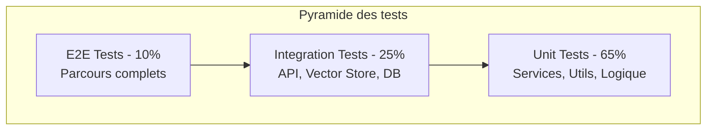

# Stratégie de Tests & Vérification

## Pyramide des tests



## Tests unitaires

### Couverture cible

| Module | Cible | Critique | Justification |
| ------ | ----- | -------- | ------------- |
| `services/ingestion/chunker.ts` | 90% | Oui | Logique centrale du découpage |
| `services/embedding/*` | 85% | Oui | Vectorisation des chunks |
| `services/search/*` | 90% | Oui | Recherche sémantique |
| `services/generation/*` | 85% | Oui | Construction prompt + appel LLM |
| `repositories/*` | 80% | Non | Accès données |
| `utils/*` | 90% | Non | Fonctions utilitaires |
| `api/routes/*` | 70% | Non | Controllers (testés via intégration) |
| `frontend/components/*` | 60% | Non | Composants React |

### Structure des tests

```typescript
// services/ingestion/__tests__/chunker.test.ts
import { describe, it, expect, beforeEach } from 'vitest';
import { Chunker, ChunkOptions } from '../chunker';

describe('Chunker', () => {
  let chunker: Chunker;
  const defaultOptions: ChunkOptions = {
    chunkSize: 100,
    chunkOverlap: 20
  };

  beforeEach(() => {
    chunker = new Chunker(defaultOptions);
  });

  describe('chunk()', () => {
    it('should split text into chunks of specified size', () => {
      // Arrange
      const text = 'A'.repeat(250);

      // Act
      const chunks = chunker.chunk(text);

      // Assert
      expect(chunks).toHaveLength(3);
      expect(chunks[0].text).toHaveLength(100);
    });

    it('should apply overlap between consecutive chunks', () => {
      // Arrange
      const text = 'A'.repeat(200);

      // Act
      const chunks = chunker.chunk(text);

      // Assert
      const overlapText = chunks[0].text.slice(-20);
      expect(chunks[1].text.startsWith(overlapText)).toBe(true);
    });

    it('should return single chunk for short text', () => {
      // Arrange
      const text = 'Short text';

      // Act
      const chunks = chunker.chunk(text);

      // Assert
      expect(chunks).toHaveLength(1);
      expect(chunks[0].text).toBe(text);
    });

    it('should throw error for empty text', () => {
      // Arrange & Act & Assert
      expect(() => chunker.chunk('')).toThrow('Text cannot be empty');
    });

    it('should handle text with special characters', () => {
      // Arrange
      const text = 'Texte avec accents éàü et émojis 🎉'.repeat(10);

      // Act
      const chunks = chunker.chunk(text);

      // Assert
      expect(chunks.length).toBeGreaterThan(0);
      chunks.forEach(chunk => {
        expect(chunk.text.length).toBeLessThanOrEqual(100);
      });
    });
  });

  describe('chunk() with custom options', () => {
    it('should respect custom chunk size', () => {
      // Arrange
      const customChunker = new Chunker({ chunkSize: 50, chunkOverlap: 10 });
      const text = 'A'.repeat(150);

      // Act
      const chunks = customChunker.chunk(text);

      // Assert
      expect(chunks[0].text).toHaveLength(50);
    });
  });
});
```

### Conventions de nommage

- Fichiers : `*.test.ts` ou `*.spec.ts` dans un dossier `__tests__`
- Descriptions : `should [verbe] when [condition]`
- Pattern AAA : Arrange, Act, Assert

### Mocking

```typescript
// Mocking d'un service externe
import { vi, describe, it, expect, beforeEach } from 'vitest';
import { SearchService } from '../search-service';
import { Embedder } from '../../types';

describe('SearchService', () => {
  let searchService: SearchService;
  let mockEmbedder: Embedder;
  let mockVectorStore: VectorStoreRepository;

  beforeEach(() => {
    mockEmbedder = {
      embed: vi.fn().mockResolvedValue([0.1, 0.2, 0.3]),
      embedBatch: vi.fn()
    };

    mockVectorStore = {
      search: vi.fn().mockResolvedValue([
        { id: '1', score: 0.9 },
        { id: '2', score: 0.8 }
      ]),
      add: vi.fn(),
      delete: vi.fn()
    };

    searchService = new SearchService(mockEmbedder, mockVectorStore);
  });

  it('should call embedder with query', async () => {
    await searchService.search('test query', { topK: 5 });
    
    expect(mockEmbedder.embed).toHaveBeenCalledWith('test query');
  });

  it('should call vector store with embedding', async () => {
    await searchService.search('test query', { topK: 5 });
    
    expect(mockVectorStore.search).toHaveBeenCalledWith([0.1, 0.2, 0.3], 5);
  });
});
```

## Tests d'intégration

### Scénarios critiques

| ID | Scénario | Composants impliqués | Priorité |
| --- | -------- | -------------------- | -------- |
| INT-001 | Ingestion complète d'un document | Loader → Chunker → Embedder → VectorStore | Must |
| INT-002 | Query RAG end-to-end | API → Search → VectorStore → LLM | Must |
| INT-003 | Status de l'index | API → MetadataStore | Should |
| INT-004 | Gestion des erreurs API | API → ErrorHandler | Must |

### Configuration environnement test

```typescript
// tests/setup/integration.ts
import { beforeAll, afterAll, beforeEach } from 'vitest';
import { createTestDatabase } from './test-db';
import { createTestVectorStore } from './test-vector-store';

let testDb: Database;
let testVectorStore: VectorStore;

beforeAll(async () => {
  // Initialiser SQLite en mémoire
  testDb = await createTestDatabase();
  
  // Initialiser vector store de test
  testVectorStore = await createTestVectorStore();
});

afterAll(async () => {
  await testDb.close();
  await testVectorStore.close();
});

beforeEach(async () => {
  // Reset les données
  await testDb.exec('DELETE FROM chunks');
  await testDb.exec('DELETE FROM documents');
  await testVectorStore.clear();
});
```

### Exemple test d'intégration API

```typescript
// api/__tests__/query.integration.test.ts
import { describe, it, expect, beforeAll, afterAll } from 'vitest';
import request from 'supertest';
import { createApp } from '../app';
import { seedTestData } from '../../tests/fixtures';

describe('POST /api/query', () => {
  let app: Express;

  beforeAll(async () => {
    app = await createApp({ testMode: true });
    await seedTestData();
  });

  it('should return answer with sources for valid query', async () => {
    const response = await request(app)
      .post('/api/query')
      .send({ question: 'What is RAG?', options: { topK: 3 } })
      .expect(200);

    expect(response.body.success).toBe(true);
    expect(response.body.answer).toBeDefined();
    expect(response.body.sources).toHaveLength(3);
    expect(response.body.sources[0]).toHaveProperty('score');
    expect(response.body.sources[0]).toHaveProperty('text');
  });

  it('should return 400 for empty question', async () => {
    const response = await request(app)
      .post('/api/query')
      .send({ question: '' })
      .expect(400);

    expect(response.body.success).toBe(false);
    expect(response.body.error.code).toBe('VALIDATION_ERROR');
  });

  it('should return 400 when index is empty', async () => {
    // Clear index first
    await clearTestIndex();
    
    const response = await request(app)
      .post('/api/query')
      .send({ question: 'Test query' })
      .expect(400);

    expect(response.body.error.message).toContain('Index is empty');
  });
});
```

## Tests E2E

### Parcours critiques à couvrir (OBLIGATOIRE)


### Scénarios E2E

| ID | Parcours | Steps | Priorité |
| --- | -------- | ----- | -------- |
| E2E-001 | Pipeline RAG complet | Ingest → Query → Verify response | Must |
| E2E-002 | Frontend Query UI | Open app → Enter query → See results | Should |
| E2E-003 | Error recovery | Query empty index → See error message | Should |

### Exemple test E2E (Playwright si UI)

```typescript
// e2e/rag-flow.e2e.test.ts
import { test, expect } from '@playwright/test';

test.describe('RAG Flow', () => {
  test('should complete full RAG query flow', async ({ page }) => {
    // Navigate to app
    await page.goto('/');

    // Enter a query
    await page.fill('[data-testid="query-input"]', 'What is RAG?');
    await page.click('[data-testid="submit-button"]');

    // Wait for response
    await expect(page.locator('[data-testid="answer"]')).toBeVisible({ timeout: 10000 });

    // Verify answer exists
    const answer = await page.textContent('[data-testid="answer"]');
    expect(answer).toBeTruthy();

    // Verify sources are displayed
    const sources = await page.locator('[data-testid="source-item"]').count();
    expect(sources).toBeGreaterThan(0);
  });
});
```

## Tests de performance

| Test | Outil | Métrique | Seuil acceptable | Seuil cible |
| ---- | ----- | -------- | ---------------- | ----------- |
| Query latency | Vitest benchmark | p95 response time | < 5s | < 2s |
| Ingestion throughput | Custom script | docs/second | > 1 doc/s | > 5 docs/s |
| Embedding batch | Vitest benchmark | chunks/second | > 10 | > 50 |
| Memory usage | Node.js --inspect | Peak memory | < 500MB | < 200MB |

### Exemple benchmark

```typescript
// benchmarks/search.bench.ts
import { bench, describe } from 'vitest';
import { SearchService } from '../services/search';

describe('SearchService benchmarks', () => {
  bench('search with topK=5', async () => {
    await searchService.search('What is machine learning?', { topK: 5 });
  });

  bench('search with topK=10', async () => {
    await searchService.search('What is machine learning?', { topK: 10 });
  });
});
```

## Tests de sécurité

| Type | Outil | Fréquence | Bloquant |
| ---- | ----- | --------- | -------- |
| SAST (Static Analysis) | ESLint security plugin | Chaque PR | Oui (critical) |
| Dependency scan | npm audit | Chaque build | Oui (critical) |
| Secret detection | git-secrets / gitleaks | Pre-commit | Oui |
| API input validation | Zod schemas | Runtime | - |

### Configuration npm audit

```json
// package.json
{
  "scripts": {
    "security:audit": "npm audit --audit-level=high",
    "security:check": "npm audit --audit-level=critical"
  }
}
```

### Validation des inputs

```typescript
// api/validators/query.ts
import { z } from 'zod';

export const QueryRequestSchema = z.object({
  question: z.string()
    .min(1, 'Question cannot be empty')
    .max(1000, 'Question too long'),
  options: z.object({
    topK: z.number().min(1).max(20).default(5),
    temperature: z.number().min(0).max(2).default(0.2)
  }).optional()
});

// Usage dans le controller
export async function queryHandler(req: Request, res: Response) {
  const result = QueryRequestSchema.safeParse(req.body);
  if (!result.success) {
    throw new ValidationError(result.error.message);
  }
  // ...
}
```

## Critères de validation

### Definition of Done

- [ ] Tests unitaires écrits et passants
- [ ] Couverture > seuil défini par module
- [ ] Pas de régression (tous les tests existants passent)
- [ ] Tests d'intégration pour les endpoints modifiés
- [ ] Review effectuée par au moins 1 pair
- [ ] Documentation mise à jour si API change
- [ ] Pas de vulnérabilités critiques (npm audit)

### Critères d'acceptance automatisés

| Story | Critère | Test automatisé |
| ----- | ------- | --------------- |
| US-001 Ingestion | Documents .txt et .md chargés | `ingestion.integration.test.ts` |
| US-002 Chunking | Chunks créés avec overlap | `chunker.test.ts` |
| US-003 Indexation | Vecteurs stockés avec metadata | `vector-store.integration.test.ts` |
| US-005 Query | Réponse générée en < 5s | `query.integration.test.ts` |
| US-006 Sources | Sources affichées avec score | `query.integration.test.ts` |

## Configuration CI

```yaml
# .github/workflows/test.yml
name: Tests

on: [push, pull_request]

jobs:
  test:
    runs-on: ubuntu-latest
    steps:
      - uses: actions/checkout@v4
      
      - uses: actions/setup-node@v4
        with:
          node-version: '20'
          cache: 'npm'
      
      - name: Install dependencies
        run: npm ci
      
      - name: Lint
        run: npm run lint
      
      - name: Type check
        run: npm run type-check
      
      - name: Unit tests
        run: npm run test:unit -- --coverage
      
      - name: Integration tests
        run: npm run test:integration
      
      - name: Security audit
        run: npm audit --audit-level=critical
      
      - name: Upload coverage
        uses: codecov/codecov-action@v3
        with:
          files: ./coverage/lcov.info
```

## Scripts de test

```json
// package.json
{
  "scripts": {
    "test": "vitest",
    "test:unit": "vitest run --dir src",
    "test:integration": "vitest run --dir tests/integration",
    "test:e2e": "playwright test",
    "test:coverage": "vitest run --coverage",
    "test:watch": "vitest watch",
    "test:ui": "vitest --ui"
  }
}
```
