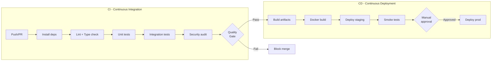
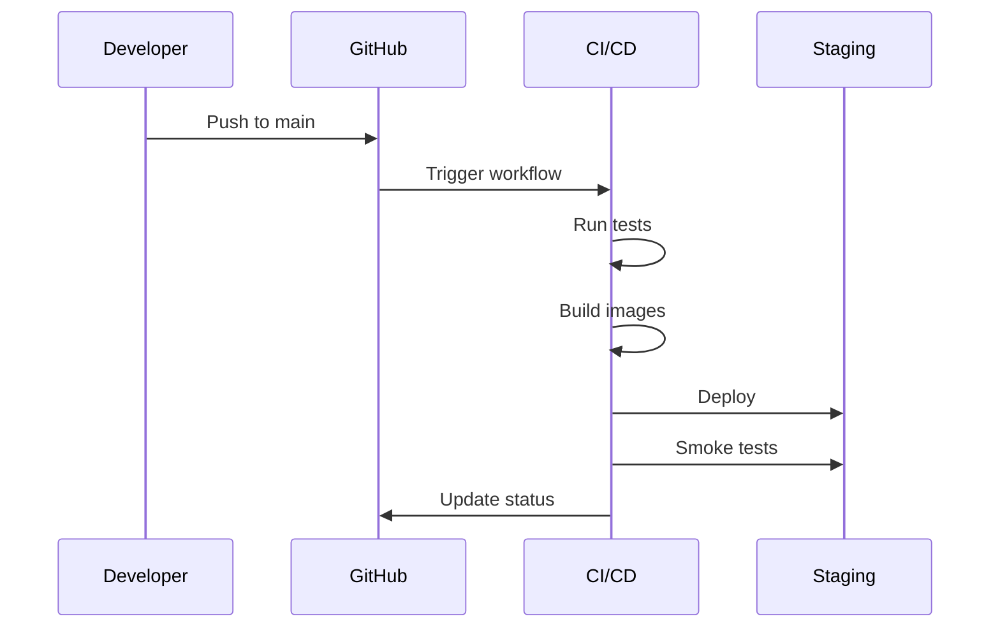
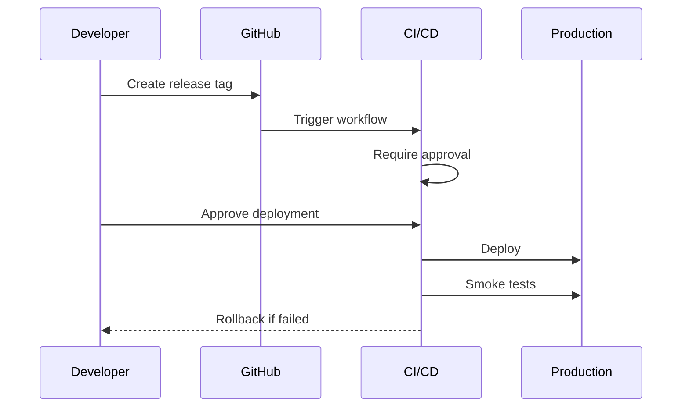

# Intégration & Déploiement

## Vue d'ensemble pipeline CI/CD



## Environnements

| Environnement | URL | Purpose | Déploiement |
| ------------- | --- | ------- | ----------- |
| local | localhost:3000 / localhost:5173 | Développement | Manuel |
| staging | staging.rag-tp.example.com | Tests d'intégration | Auto (main branch) |
| production | rag-tp.example.com | Production | Manuel (approval) |

## Variables d'environnement par environnement

### Local (.env.local)

```bash
# API
NODE_ENV=development
PORT=3000
LOG_LEVEL=debug

# Frontend
VITE_API_URL=http://localhost:3000/api

# Vector Store
VECTOR_STORE_TYPE=chroma
CHROMA_HOST=http://localhost:8000

# Embeddings
EMBEDDING_PROVIDER=openai
OPENAI_API_KEY=sk-xxx

# LLM
LLM_PROVIDER=openai
LLM_MODEL=gpt-4o-mini
LLM_MOCK_MODE=true

# Database
SQLITE_PATH=./data/metadata.db
```

### Staging (.env.staging)

```bash
NODE_ENV=staging
PORT=3000
LOG_LEVEL=info

VECTOR_STORE_TYPE=chroma
CHROMA_HOST=http://chroma-staging:8000

EMBEDDING_PROVIDER=openai
OPENAI_API_KEY=${OPENAI_API_KEY}  # From secrets

LLM_PROVIDER=openai
LLM_MODEL=gpt-4o-mini
LLM_MOCK_MODE=false

SQLITE_PATH=/app/data/metadata.db
```

### Production (.env.production)

```bash
NODE_ENV=production
PORT=3000
LOG_LEVEL=warn

VECTOR_STORE_TYPE=chroma
CHROMA_HOST=http://chroma-prod:8000

EMBEDDING_PROVIDER=openai
OPENAI_API_KEY=${OPENAI_API_KEY}

LLM_PROVIDER=openai
LLM_MODEL=gpt-4o-mini
LLM_MOCK_MODE=false

SQLITE_PATH=/app/data/metadata.db
```

## Configuration Docker

### Dockerfile Backend

```dockerfile
# backend/Dockerfile
FROM node:20-alpine AS builder

WORKDIR /app

# Install dependencies
COPY package*.json ./
RUN npm ci

# Copy source and build
COPY . .
RUN npm run build

# Production image
FROM node:20-alpine

WORKDIR /app

# Security: non-root user
RUN addgroup -g 1001 -S nodejs && \
    adduser -S nodejs -u 1001

# Copy built artifacts
COPY --from=builder --chown=nodejs:nodejs /app/dist ./dist
COPY --from=builder --chown=nodejs:nodejs /app/node_modules ./node_modules
COPY --from=builder --chown=nodejs:nodejs /app/package.json ./

# Create data directory
RUN mkdir -p /app/data && chown -R nodejs:nodejs /app/data

USER nodejs

EXPOSE 3000

HEALTHCHECK --interval=30s --timeout=3s --start-period=5s --retries=3 \
  CMD wget --no-verbose --tries=1 --spider http://localhost:3000/api/status || exit 1

CMD ["node", "dist/index.js"]
```

### Dockerfile Frontend

```dockerfile
# frontend/Dockerfile
FROM node:20-alpine AS builder

WORKDIR /app

COPY package*.json ./
RUN npm ci

COPY . .
ARG VITE_API_URL
ENV VITE_API_URL=${VITE_API_URL}
RUN npm run build

# Production with nginx
FROM nginx:alpine

COPY --from=builder /app/dist /usr/share/nginx/html
COPY nginx.conf /etc/nginx/conf.d/default.conf

EXPOSE 80

CMD ["nginx", "-g", "daemon off;"]
```

### docker-compose.yml (développement)

```yaml
version: '3.8'

services:
  backend:
    build:
      context: ./backend
      dockerfile: Dockerfile
    ports:
      - "3000:3000"
    environment:
      - NODE_ENV=development
      - CHROMA_HOST=http://chroma:8000
    volumes:
      - ./data:/app/data
    depends_on:
      chroma:
        condition: service_healthy

  frontend:
    build:
      context: ./frontend
      dockerfile: Dockerfile
      args:
        VITE_API_URL: http://localhost:3000/api
    ports:
      - "5173:80"
    depends_on:
      - backend

  chroma:
    image: chromadb/chroma:latest
    ports:
      - "8000:8000"
    volumes:
      - chroma-data:/chroma/chroma
    healthcheck:
      test: ["CMD", "curl", "-f", "http://localhost:8000/api/v1/heartbeat"]
      interval: 10s
      timeout: 5s
      retries: 5

volumes:
  chroma-data:
```

### docker-compose.prod.yml

```yaml
version: '3.8'

services:
  backend:
    image: ${REGISTRY}/rag-tp-backend:${VERSION}
    restart: always
    environment:
      - NODE_ENV=production
      - CHROMA_HOST=http://chroma:8000
    env_file:
      - .env.production
    volumes:
      - backend-data:/app/data
    deploy:
      resources:
        limits:
          memory: 512M
          cpus: '0.5'

  frontend:
    image: ${REGISTRY}/rag-tp-frontend:${VERSION}
    restart: always
    ports:
      - "80:80"
      - "443:443"
    depends_on:
      - backend

  chroma:
    image: chromadb/chroma:latest
    restart: always
    volumes:
      - chroma-data:/chroma/chroma
    deploy:
      resources:
        limits:
          memory: 1G
          cpus: '1'

volumes:
  backend-data:
  chroma-data:
```

## Pipeline CI complet

### GitHub Actions Workflow

```yaml
# .github/workflows/ci-cd.yml
name: CI/CD Pipeline

on:
  push:
    branches: [main, develop]
  pull_request:
    branches: [main]

env:
  REGISTRY: ghcr.io
  IMAGE_NAME: ${{ github.repository }}

jobs:
  # ================================
  # CI - Tests & Quality
  # ================================
  lint:
    runs-on: ubuntu-latest
    steps:
      - uses: actions/checkout@v4
      - uses: actions/setup-node@v4
        with:
          node-version: '20'
          cache: 'npm'
      - run: npm ci
      - run: npm run lint
      - run: npm run type-check

  test-unit:
    runs-on: ubuntu-latest
    steps:
      - uses: actions/checkout@v4
      - uses: actions/setup-node@v4
        with:
          node-version: '20'
          cache: 'npm'
      - run: npm ci
      - run: npm run test:unit -- --coverage
      - uses: codecov/codecov-action@v3
        with:
          files: ./coverage/lcov.info

  test-integration:
    runs-on: ubuntu-latest
    services:
      chroma:
        image: chromadb/chroma:latest
        ports:
          - 8000:8000
    steps:
      - uses: actions/checkout@v4
      - uses: actions/setup-node@v4
        with:
          node-version: '20'
          cache: 'npm'
      - run: npm ci
      - run: npm run test:integration
        env:
          CHROMA_HOST: http://localhost:8000

  security:
    runs-on: ubuntu-latest
    steps:
      - uses: actions/checkout@v4
      - uses: actions/setup-node@v4
        with:
          node-version: '20'
          cache: 'npm'
      - run: npm ci
      - run: npm audit --audit-level=critical
      - name: Run Trivy vulnerability scanner
        uses: aquasecurity/trivy-action@master
        with:
          scan-type: 'fs'
          scan-ref: '.'
          severity: 'CRITICAL,HIGH'

  # ================================
  # CD - Build & Deploy
  # ================================
  build:
    needs: [lint, test-unit, test-integration, security]
    runs-on: ubuntu-latest
    if: github.ref == 'refs/heads/main'
    permissions:
      contents: read
      packages: write
    outputs:
      version: ${{ steps.version.outputs.version }}
    steps:
      - uses: actions/checkout@v4
      
      - name: Generate version
        id: version
        run: echo "version=$(date +'%Y%m%d')-${GITHUB_SHA::7}" >> $GITHUB_OUTPUT
      
      - name: Login to GitHub Container Registry
        uses: docker/login-action@v3
        with:
          registry: ${{ env.REGISTRY }}
          username: ${{ github.actor }}
          password: ${{ secrets.GITHUB_TOKEN }}
      
      - name: Build and push backend
        uses: docker/build-push-action@v5
        with:
          context: ./backend
          push: true
          tags: |
            ${{ env.REGISTRY }}/${{ env.IMAGE_NAME }}-backend:${{ steps.version.outputs.version }}
            ${{ env.REGISTRY }}/${{ env.IMAGE_NAME }}-backend:latest
      
      - name: Build and push frontend
        uses: docker/build-push-action@v5
        with:
          context: ./frontend
          push: true
          build-args: |
            VITE_API_URL=${{ vars.STAGING_API_URL }}
          tags: |
            ${{ env.REGISTRY }}/${{ env.IMAGE_NAME }}-frontend:${{ steps.version.outputs.version }}
            ${{ env.REGISTRY }}/${{ env.IMAGE_NAME }}-frontend:latest

  deploy-staging:
    needs: build
    runs-on: ubuntu-latest
    environment: staging
    steps:
      - uses: actions/checkout@v4
      
      - name: Deploy to staging
        run: |
          echo "Deploying version ${{ needs.build.outputs.version }} to staging"
          # SSH deploy or Kubernetes apply
      
      - name: Run smoke tests
        run: |
          curl -f https://staging.rag-tp.example.com/api/status || exit 1

  deploy-production:
    needs: [build, deploy-staging]
    runs-on: ubuntu-latest
    environment: production
    steps:
      - uses: actions/checkout@v4
      
      - name: Deploy to production
        run: |
          echo "Deploying version ${{ needs.build.outputs.version }} to production"
          # Production deployment command
```

## Procédures de déploiement

### Déploiement local

```bash
# 1. Cloner le repository
git clone https://github.com/org/rag-tp.git
cd rag-tp

# 2. Copier les variables d'environnement
cp .env.example .env.local

# 3. Configurer la clé API OpenAI
# Éditer .env.local et ajouter OPENAI_API_KEY

# 4. Démarrer avec Docker Compose
docker compose up -d

# 5. Vérifier le statut
curl http://localhost:3000/api/status

# 6. Accéder à l'application
open http://localhost:5173
```

### Déploiement staging (automatique)



### Déploiement production (manuel)



### Procédure de rollback

```bash
# 1. Identifier la version précédente
docker images | grep rag-tp-backend

# 2. Mettre à jour le fichier de version
echo "VERSION=20240115-abc1234" > .env.version

# 3. Redéployer
docker compose -f docker-compose.prod.yml up -d

# 4. Vérifier
curl https://rag-tp.example.com/api/status
```

## Checklist pré-déploiement

### Staging

- [ ] Tous les tests CI passent
- [ ] Pas de vulnérabilités critiques
- [ ] Variables d'environnement configurées
- [ ] Documentation à jour

### Production

- [ ] Staging validé (smoke tests OK)
- [ ] Changelog à jour
- [ ] Backup des données effectué
- [ ] Approbation obtenue
- [ ] Fenêtre de maintenance communiquée
- [ ] Procédure de rollback prête

## Monitoring du déploiement

| Métrique | Seuil d'alerte | Action |
| -------- | -------------- | ------ |
| Health check failures | > 3 consécutifs | Rollback automatique |
| Error rate post-deploy | > 5% pendant 5min | Alerte + investigation |
| Response time p95 | > 10s pendant 5min | Alerte |
| Memory usage | > 90% | Scale up |

## Configuration secrets

### GitHub Secrets

| Secret | Description | Utilisé par |
| ------ | ----------- | ----------- |
| `OPENAI_API_KEY` | Clé API OpenAI | Backend |
| `GITHUB_TOKEN` | Token pour container registry | CI/CD |
| `DEPLOY_SSH_KEY` | Clé SSH pour déploiement | Deploy jobs |

### Configuration dans GitHub

1. Settings → Secrets and variables → Actions
2. Ajouter chaque secret
3. Pour les variables non-sensibles, utiliser Variables

## Scripts utilitaires

```json
// package.json root
{
  "scripts": {
    "docker:build": "docker compose build",
    "docker:up": "docker compose up -d",
    "docker:down": "docker compose down",
    "docker:logs": "docker compose logs -f",
    "docker:prod:up": "docker compose -f docker-compose.prod.yml up -d",
    "deploy:staging": "gh workflow run ci-cd.yml -f environment=staging",
    "deploy:prod": "gh workflow run ci-cd.yml -f environment=production"
  }
}
```
