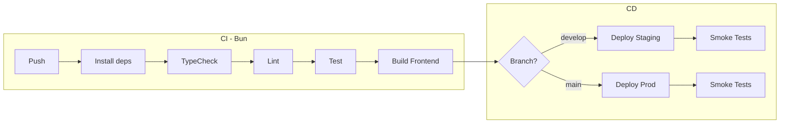

# Intégration & Déploiement

Ce document décrit le pipeline CI/CD et les procédures de déploiement pour le projet RAG, utilisant **Bun** comme runtime (clarification 004).

---

## Pipeline CI/CD (OBLIGATOIRE)



---

## Configuration GitHub Actions

### `.github/workflows/ci.yml`

```yaml
name: CI

on:
  push:
    branches: [main, develop]
  pull_request:
    branches: [main, develop]

jobs:
  ci:
    runs-on: ubuntu-latest
    
    steps:
      - name: Checkout
        uses: actions/checkout@v4

      - name: Setup Bun
        uses: oven-sh/setup-bun@v1
        with:
          bun-version: latest

      - name: Install backend dependencies
        working-directory: ./project/backend
        run: bun install --frozen-lockfile

      - name: Install frontend dependencies
        working-directory: ./project/frontend
        run: bun install --frozen-lockfile

      - name: TypeCheck backend
        working-directory: ./project/backend
        run: bun run typecheck

      - name: TypeCheck frontend
        working-directory: ./project/frontend
        run: bun run typecheck

      - name: Lint
        working-directory: ./project/backend
        run: bunx eslint src/ --max-warnings 0

      - name: Test backend
        working-directory: ./project/backend
        run: bun test

      - name: Build frontend
        working-directory: ./project/frontend
        run: bun run build

      - name: Upload frontend artifacts
        uses: actions/upload-artifact@v4
        with:
          name: frontend-dist
          path: ./project/frontend/dist
```

### `.github/workflows/cd-staging.yml`

```yaml
name: Deploy Staging

on:
  push:
    branches: [develop]

jobs:
  deploy:
    runs-on: ubuntu-latest
    environment: staging
    
    steps:
      - name: Checkout
        uses: actions/checkout@v4

      - name: Setup Bun
        uses: oven-sh/setup-bun@v1

      - name: Install dependencies
        run: |
          cd project/backend && bun install --frozen-lockfile
          cd ../frontend && bun install --frozen-lockfile

      - name: Build
        run: |
          cd project/frontend && bun run build

      - name: Deploy to staging
        run: |
          # Exemple : rsync, Docker push, ou cloud deploy
          echo "Deploying to staging..."

      - name: Smoke tests
        run: |
          # curl -f https://staging.example.com/api/health
          echo "Smoke tests passed"
```

---

## Environnements

| Environnement | URL | Déploiement | Usage |
| ------------- | --- | ----------- | ----- |
| **Development** | localhost:3000 (API), localhost:5173 (UI) | Manuel (`bun run dev`) | Dev local |
| **Staging** | staging.rag-tp.example.com | Auto sur `develop` | Tests intégration |
| **Production** | rag-tp.example.com | Manuel + approbation | Production |

---

## Configuration par environnement

| Variable | Dev | Staging | Prod |
| -------- | --- | ------- | ---- |
| `OPENAI_API_KEY` | `.env` local | Secret GitHub | Secret GitHub |
| `CHROMA_HOST` | localhost | chroma-staging | chroma-prod |
| `CHROMA_PORT` | 8000 | 8000 | 8000 |
| `LOG_LEVEL` | debug | info | warn |
| `LLM_PROVIDER` | mock | openai | openai |
| `EMBEDDING_PROVIDER` | local | openai | openai |

### Fichier `.env` (dev local)

```bash
# API Keys (optionnel en dev)
OPENAI_API_KEY=sk-xxx

# Vector Store
CHROMA_HOST=localhost
CHROMA_PORT=8000

# Mode dev
LLM_PROVIDER=mock
EMBEDDING_PROVIDER=local
LOG_LEVEL=debug

# Server
PORT=3000
```

---

## Procédures de déploiement

### Développement local

```bash
# 1. Cloner le repo
git clone https://github.com/org/rag-tp.git
cd rag-tp

# 2. Lancer ChromaDB
docker-compose up -d

# 3. Installer les dépendances
cd project/backend && bun install
cd ../frontend && bun install

# 4. Configurer l'environnement
cp .env.example .env
# Éditer .env si nécessaire

# 5. Lancer le backend
cd project/backend
bun run dev

# 6. Lancer le frontend (autre terminal)
cd project/frontend
bun run dev
```

### Déploiement Staging

1. Merger PR dans `develop`
2. GitHub Actions déploie automatiquement
3. Vérifier les logs du workflow
4. Tester manuellement l'environnement staging
5. Valider avec l'équipe

### Déploiement Production

1. Créer PR `develop` → `main`
2. Review obligatoire (minimum 1 approbation)
3. Merger la PR
4. GitHub Actions build et prépare le déploiement
5. Approbation manuelle dans GitHub Environments
6. Déploiement automatique post-approbation
7. Smoke tests automatiques
8. Communiquer le déploiement à l'équipe

### Rollback

```bash
# 1. Identifier le dernier commit stable
git log --oneline -10

# 2. Revert le commit problématique
git revert <commit-hash>
git push origin main

# 3. OU redéployer un tag précédent
git checkout v1.2.3
# Déclencher le pipeline manuellement
```

---

## Dockerfile (optionnel)

```dockerfile
# Dockerfile pour le backend
FROM oven/bun:1 as base
WORKDIR /app

# Install dependencies
FROM base AS install
COPY package.json bun.lockb ./
RUN bun install --frozen-lockfile --production

# Copy source
FROM base AS release
COPY --from=install /app/node_modules node_modules
COPY src ./src
COPY tsconfig.json .

# Run
USER bun
EXPOSE 3000
ENTRYPOINT ["bun", "run", "src/index.ts"]
```

### docker-compose.yml complet

```yaml
version: '3.8'

services:
  backend:
    build: ./project/backend
    ports:
      - "3000:3000"
    environment:
      - CHROMA_HOST=chromadb
      - CHROMA_PORT=8000
      - OPENAI_API_KEY=${OPENAI_API_KEY}
    depends_on:
      - chromadb

  frontend:
    build: ./project/frontend
    ports:
      - "80:80"
    depends_on:
      - backend

  chromadb:
    image: chromadb/chroma:latest
    ports:
      - "8000:8000"
    volumes:
      - chroma-data:/chroma/chroma
    environment:
      - IS_PERSISTENT=TRUE
      - ANONYMIZED_TELEMETRY=FALSE

volumes:
  chroma-data:
```

---

## Infrastructure as Code

### Structure

```
infrastructure/
├── docker/
│   ├── backend.Dockerfile
│   └── frontend.Dockerfile
├── docker-compose.yml
├── docker-compose.prod.yml
└── scripts/
    ├── deploy-staging.sh
    └── deploy-prod.sh
```

### Script de déploiement

```bash
#!/bin/bash
# scripts/deploy-staging.sh

set -e

echo "🚀 Deploying to staging..."

# Pull latest
git pull origin develop

# Install dependencies
cd project/backend && bun install --frozen-lockfile
cd ../frontend && bun install --frozen-lockfile

# Build frontend
cd ../frontend && bun run build

# Restart services
pm2 restart rag-backend || pm2 start bun --name rag-backend -- run src/index.ts

echo "✅ Deployment complete"
```

---

## Checklist de déploiement

### Pré-déploiement

- [ ] Tests locaux passent (`bun test`)
- [ ] TypeCheck passe (`bun run typecheck`)
- [ ] Build frontend réussit (`bun run build`)
- [ ] Variables d'environnement configurées sur la cible
- [ ] ChromaDB accessible
- [ ] Clé API OpenAI valide (si mode openai)
- [ ] Plan de rollback documenté

### Post-déploiement

- [ ] Health check OK (`GET /api/health`)
- [ ] ChromaDB connecté (vérifié via health check)
- [ ] Test manuel d'une requête RAG
- [ ] Logs sans erreurs critiques
- [ ] Métriques nominales
- [ ] Communication à l'équipe

---

## Monitoring du déploiement

### Health check endpoint

```typescript
// GET /api/health
{
  "status": "ok",
  "runtime": "bun",
  "version": "1.0.0",
  "timestamp": "2026-01-28T14:00:00Z",
  "checks": {
    "vectorStore": "connected",
    "database": "connected"
  }
}
```

### Logs structurés

```typescript
// Utiliser un logger JSON pour la prod
import pino from 'pino';

const logger = pino({
  level: Bun.env.LOG_LEVEL || 'info',
  transport: Bun.env.NODE_ENV === 'development' 
    ? { target: 'pino-pretty' } 
    : undefined
});

logger.info({ event: 'server_start', port: 3000 }, 'Server started');
logger.error({ event: 'query_error', error: err.message }, 'Query failed');
```

---

## Sécurité CI/CD

### Secrets GitHub

| Secret | Usage |
|--------|-------|
| `OPENAI_API_KEY` | Clé API pour embedding et LLM |
| `DEPLOY_SSH_KEY` | Clé SSH pour déploiement |
| `DOCKER_TOKEN` | Token Docker Hub (si push images) |

### Bonnes pratiques

- ✅ Utiliser `bun install --frozen-lockfile` en CI
- ✅ Ne jamais logger les secrets
- ✅ Utiliser les GitHub Environments avec approbation
- ✅ Scanner les dépendances (`bunx audit`)
- ❌ Ne pas commit `.env` ou `bun.lockb` avec des secrets
