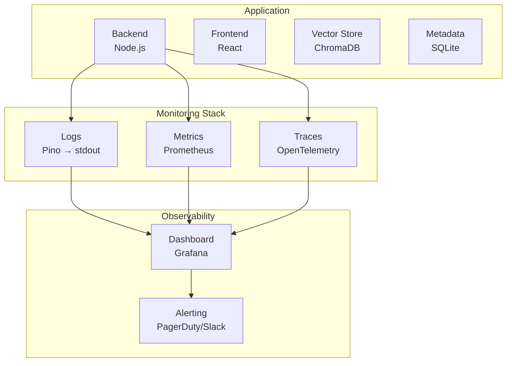
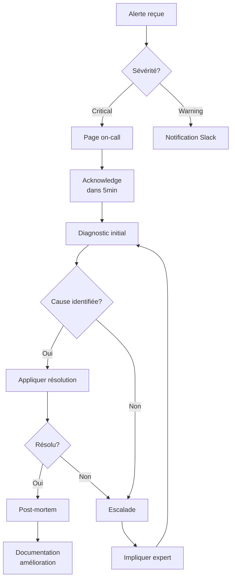

# Maintenance & Exploitation

## Vue d'ensemble du monitoring



## SLOs et SLAs

### Service Level Objectives (SLOs)

| Métrique | SLO | Mesure | Fenêtre |
| -------- | --- | ------ | ------- |
| Disponibilité | 99.5% | Uptime / temps total | 30 jours |
| Latence query p50 | < 2s | Temps réponse /api/query | Rolling 1h |
| Latence query p95 | < 5s | Temps réponse /api/query | Rolling 1h |
| Error rate | < 1% | Erreurs 5xx / total requêtes | Rolling 1h |
| Ingestion success | > 99% | Documents ingérés / tentatives | 24h |

### Service Level Agreements (SLAs) - si applicable

| Niveau | Disponibilité | Temps réponse incident | Support |
| ------ | ------------- | ---------------------- | ------- |
| Standard | 99% | 4h (business hours) | Email |
| Premium | 99.5% | 1h (24/7) | Slack + Email |

### Error Budget

```
Error budget mensuel = 100% - SLO = 0.5%
Temps d'indisponibilité autorisé = 30j × 24h × 0.5% = 3.6h/mois
```

## Logging

### Structure des logs (Pino)

```typescript
// Configuration pino
import pino from 'pino';

export const logger = pino({
  level: process.env.LOG_LEVEL || 'info',
  formatters: {
    level: (label) => ({ level: label })
  },
  timestamp: pino.stdTimeFunctions.isoTime
});

// Exemple d'utilisation
logger.info({ 
  requestId: 'req-123',
  userId: 'user-456',
  action: 'query',
  duration: 1234
}, 'Query completed successfully');
```

### Format des logs

```json
{
  "level": "info",
  "time": "2024-01-15T10:30:00.000Z",
  "requestId": "req-123",
  "userId": "user-456",
  "action": "query",
  "duration": 1234,
  "msg": "Query completed successfully"
}
```

### Niveaux de log

| Niveau | Utilisation | Exemples |
| ------ | ----------- | -------- |
| `error` | Erreurs nécessitant attention | Échec connexion DB, erreur API externe |
| `warn` | Situations anormales non-bloquantes | Rate limit proche, cache miss élevé |
| `info` | Événements métier significatifs | Query exécutée, document ingéré |
| `debug` | Détails pour debugging | Contenu chunks, scores similarity |
| `trace` | Traces très détaillées | Appels fonction par fonction |

### Logs critiques à monitorer

| Pattern | Signification | Action |
| ------- | ------------- | ------ |
| `level: "error"` | Erreur applicative | Investigation immédiate |
| `action: "embedding_failed"` | Échec embedding | Vérifier API OpenAI |
| `action: "vector_store_error"` | Erreur ChromaDB | Vérifier service ChromaDB |
| `duration > 5000` | Requête lente | Analyser performance |

## Métriques

### Métriques applicatives

| Métrique | Type | Labels | Description |
| -------- | ---- | ------ | ----------- |
| `rag_query_total` | Counter | `status` | Nombre total de queries |
| `rag_query_duration_seconds` | Histogram | `endpoint` | Latence des queries |
| `rag_ingestion_total` | Counter | `status`, `format` | Documents ingérés |
| `rag_chunks_total` | Gauge | - | Nombre de chunks indexés |
| `rag_embedding_duration_seconds` | Histogram | `provider` | Temps d'embedding |

### Métriques infrastructure

| Métrique | Seuil warning | Seuil critical |
| -------- | ------------- | -------------- |
| CPU usage | > 70% | > 90% |
| Memory usage | > 70% | > 90% |
| Disk usage | > 70% | > 85% |
| ChromaDB connections | > 80% pool | > 95% pool |

### Configuration Prometheus (exemple)

```yaml
# prometheus.yml
global:
  scrape_interval: 15s

scrape_configs:
  - job_name: 'rag-backend'
    static_configs:
      - targets: ['backend:3000']
    metrics_path: /metrics

  - job_name: 'chroma'
    static_configs:
      - targets: ['chroma:8000']
```

## Alertes

### Règles d'alerte

| Alerte | Condition | Sévérité | Action |
| ------ | --------- | -------- | ------ |
| HighErrorRate | Error rate > 5% pendant 5min | Critical | Page on-call |
| SlowQueries | p95 latency > 10s pendant 5min | Warning | Slack notification |
| ServiceDown | Health check fail > 3 | Critical | Page on-call |
| HighMemory | Memory > 90% pendant 10min | Warning | Investigate |
| ChromaDBDown | ChromaDB unreachable | Critical | Page on-call |
| APIQuotaLow | OpenAI quota < 10% | Warning | Slack notification |

### Configuration alertes (Alertmanager)

```yaml
# alertmanager.yml
route:
  group_by: ['alertname', 'severity']
  group_wait: 30s
  group_interval: 5m
  repeat_interval: 4h
  receiver: 'slack-notifications'
  routes:
    - match:
        severity: critical
      receiver: 'pagerduty-critical'

receivers:
  - name: 'slack-notifications'
    slack_configs:
      - api_url: 'https://hooks.slack.com/services/xxx'
        channel: '#rag-alerts'
        
  - name: 'pagerduty-critical'
    pagerduty_configs:
      - service_key: 'xxx'
```

## Runbooks

### RUN-001: Service Backend Down

**Symptôme**: Health check `/api/status` retourne erreur ou timeout

**Diagnostic**:
```bash
# 1. Vérifier les logs récents
docker logs --tail 100 rag-backend

# 2. Vérifier l'état du container
docker ps -a | grep rag-backend

# 3. Vérifier la mémoire
docker stats rag-backend --no-stream

# 4. Tester la connectivité interne
docker exec rag-backend curl -s localhost:3000/api/status
```

**Résolution**:
```bash
# Option A: Restart simple
docker restart rag-backend

# Option B: Redéploiement complet
docker compose down backend
docker compose up -d backend

# Option C: Rollback si regression
docker compose down
VERSION=previous_version docker compose up -d
```

### RUN-002: ChromaDB Inaccessible

**Symptôme**: Erreurs `ECONNREFUSED` vers ChromaDB dans les logs

**Diagnostic**:
```bash
# 1. Vérifier l'état du service
docker ps | grep chroma
docker logs --tail 50 chroma

# 2. Tester la connectivité
curl http://localhost:8000/api/v1/heartbeat

# 3. Vérifier l'espace disque
df -h /var/lib/docker
```

**Résolution**:
```bash
# Restart ChromaDB
docker restart chroma

# Si corruption, restaurer depuis backup
docker compose down chroma
rm -rf ./chroma-data/*
docker compose up -d chroma
# Réingérer les documents
```

### RUN-003: Latence Élevée

**Symptôme**: p95 latency > 5s

**Diagnostic**:
```bash
# 1. Identifier les requêtes lentes
grep "duration" logs/app.log | awk -F'"duration":' '{print $2}' | sort -n | tail -20

# 2. Vérifier la charge
docker stats --no-stream

# 3. Vérifier le nombre de chunks
curl http://localhost:3000/api/status | jq '.chunksCount'
```

**Résolution**:
```bash
# Si charge élevée: scale up
docker compose up -d --scale backend=2

# Si trop de chunks: optimiser l'index
# Réduire topK dans les requêtes
```

### RUN-004: API OpenAI Rate Limited

**Symptôme**: Erreurs 429 dans les logs

**Diagnostic**:
```bash
# Vérifier le quota OpenAI
grep "429" logs/app.log | wc -l

# Vérifier le rate de requêtes
grep "embedding" logs/app.log | tail -100
```

**Résolution**:
```bash
# Court terme: activer le mock mode
# Dans .env: LLM_MOCK_MODE=true
docker restart rag-backend

# Moyen terme: implémenter rate limiting côté app
# Long terme: upgrade plan OpenAI ou utiliser embeddings locaux
```

## Gestion des incidents

### Processus de gestion d'incident



### Classification des incidents

| Sévérité | Impact | Temps de réponse | Exemples |
| -------- | ------ | ---------------- | -------- |
| SEV-1 | Service complètement down | 15min | Backend crashed, DB corrompue |
| SEV-2 | Fonctionnalité majeure impactée | 1h | Queries échouent à 50% |
| SEV-3 | Fonctionnalité mineure impactée | 4h | Latence dégradée |
| SEV-4 | Pas d'impact utilisateur | 24h | Warning dans les logs |

### Template post-mortem

```markdown
# Post-Mortem: [Titre de l'incident]

## Résumé
- **Date**: YYYY-MM-DD
- **Durée**: Xh Xmin
- **Impact**: Description de l'impact
- **Sévérité**: SEV-X

## Timeline
- HH:MM - Événement déclencheur
- HH:MM - Alerte reçue
- HH:MM - Investigation démarrée
- HH:MM - Cause identifiée
- HH:MM - Résolution appliquée
- HH:MM - Service restauré

## Cause racine
Description détaillée de la cause.

## Ce qui a bien fonctionné
- Point positif 1
- Point positif 2

## Ce qui peut être amélioré
- Point d'amélioration 1
- Point d'amélioration 2

## Actions
| Action | Responsable | Deadline | Status |
| ------ | ----------- | -------- | ------ |
| Action 1 | @personne | Date | TODO |
```

## Backup et restauration

### Stratégie de backup

| Composant | Fréquence | Rétention | Méthode |
| --------- | --------- | --------- | ------- |
| SQLite metadata | Daily | 30 jours | Copie fichier |
| ChromaDB | Daily | 7 jours | Export API |
| Configuration | À chaque changement | Illimitée | Git |

### Scripts de backup

```bash
#!/bin/bash
# backup.sh

DATE=$(date +%Y%m%d)
BACKUP_DIR="/backups/${DATE}"

mkdir -p ${BACKUP_DIR}

# Backup SQLite
cp /app/data/metadata.db ${BACKUP_DIR}/metadata.db

# Backup ChromaDB (si persistant)
docker exec chroma tar -czf - /chroma/chroma > ${BACKUP_DIR}/chroma.tar.gz

# Rotation (garder 30 jours)
find /backups -type d -mtime +30 -exec rm -rf {} \;

echo "Backup completed: ${BACKUP_DIR}"
```

### Procédure de restauration

```bash
#!/bin/bash
# restore.sh <backup_date>

BACKUP_DATE=$1
BACKUP_DIR="/backups/${BACKUP_DATE}"

# Arrêter les services
docker compose down

# Restaurer SQLite
cp ${BACKUP_DIR}/metadata.db /app/data/metadata.db

# Restaurer ChromaDB
docker run --rm -v chroma-data:/chroma/chroma -v ${BACKUP_DIR}:/backup \
  alpine tar -xzf /backup/chroma.tar.gz -C /

# Redémarrer
docker compose up -d

echo "Restore from ${BACKUP_DATE} completed"
```

## Tâches de maintenance planifiées

| Tâche | Fréquence | Automatisé | Description |
| ----- | --------- | ---------- | ----------- |
| Backup | Quotidien | Oui (cron) | Sauvegarde DB et vector store |
| Log rotation | Quotidien | Oui (logrotate) | Rotation des fichiers logs |
| Dependency audit | Hebdomadaire | Oui (CI) | npm audit |
| Security patches | Mensuel | Manuel | Mise à jour dépendances |
| Index optimization | Mensuel | Manuel | Vérification performance index |
| Cleanup old data | Mensuel | Manuel | Suppression données obsolètes |

### Crontab maintenance

```bash
# /etc/cron.d/rag-maintenance

# Backup quotidien à 2h
0 2 * * * root /opt/rag-tp/scripts/backup.sh >> /var/log/backup.log 2>&1

# Nettoyage logs à 3h
0 3 * * * root find /var/log/rag-tp -name "*.log" -mtime +7 -delete

# Health check toutes les 5 minutes
*/5 * * * * root curl -sf http://localhost:3000/api/status || echo "Health check failed" | mail -s "RAG Alert" ops@example.com
```

## Contacts et escalade

| Rôle | Contact | Responsabilité |
| ---- | ------- | -------------- |
| On-call primaire | @oncall (rotation) | Première réponse incidents |
| Tech Lead | @techlead | Escalade technique |
| DevOps | @devops | Infrastructure, déploiement |
| Product Owner | @po | Décisions business |

## Documentation complémentaire

| Document | Emplacement | Description |
| -------- | ----------- | ----------- |
| Architecture | [04-decisions-architectures.md](04-decisions-architectures.md) | ADRs et choix techniques |
| API Reference | [05-specifications-techniques.md](05-specifications-techniques.md) | Contrats API |
| Deployment | [09-integration-deploiement.md](09-integration-deploiement.md) | Procédures déploiement |
| Security | Internal wiki | Politiques sécurité |
